# Permutations and Combinations

        - Addition and Multiplication Rules
        - Permutation and Combinations
        - Example Problems

## Addition and Multiplication Rules
__Example-1:__ Given 10 Boys and 7 Girls, how many different pairs can be formed? `Pair = 1-Boy and 1-Girl`
- Here we have to select one Boy out of 10 and one Girl out of 7 to form a pair

| Boys | Girls |
|------|-------|
| B1   | G1    |
| B2   | G2    |
| B3   | G3    |
| B4   | G4    |
| B5   | G5    |
| B6   | G6    |
| B7   | G7    |
| B8   |       |
| B9   |       |
| B10  |       |


- How many ways to choose a Boy out of 10 = 10 ways (B1 or B2 or B3 or B4 or B5, ... B10)
- How Many ways to choose a Girl out of 7 = 7 Ways
- As we have to choose a pair, we have to choose **1Boy AND 1Girl**
- Whenever we see **AND** we use multiplication, So total number of pairs can be possible = 10X7 = 70pairs
````text
B1G1    B2G1
B1G2    B2G2
B1G3    B2G3
B1G4    B2G4
B1G5    B2G5
B1G6    B2G6
B1G7    B2G7
-----------------------------
7 pairs + 7 pairs
````
__Example-2:__ Number of ways to reach from Pune to Agra Via Delhi?
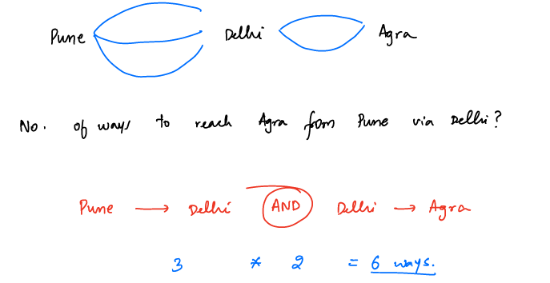

__Example-3:__ Addition Rule
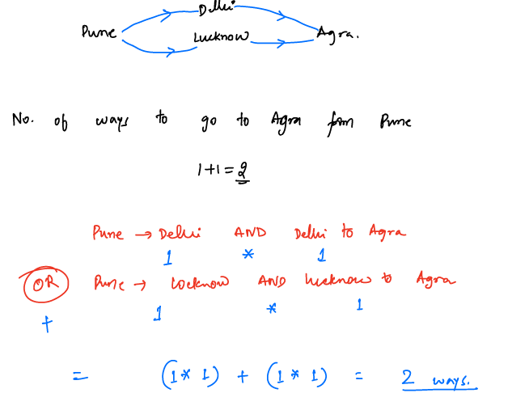

__Example-4:__ Multiplication and Addition Rules
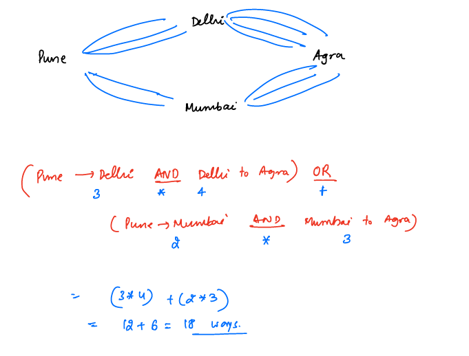


## Permutations (Arrange):
- Permutation is an arrangement of objects
- Order matters in permutations, For example, [a,b,c] != [b,a,c] these are two different permutations

__Example-1:__ Given a 3 distinct chars in how many ways can we arrange them?
````text
    s = "a b c"
    a b c
    a c b
    b a c
    b c a
    c a b
    c b a 
   There are 6 ways we can arrange 3 distinct chars  
    (OR)
    
    3 slots _ _ _
    In how many ways we can select one chars for Slot-1:   3 ways(a/b/c)
                                                 Slot-2:   2 ways(slot-1 we have already chosen one char so remaining is 2 )
                                                 Slot-2:   1 ways
    Total Number of Arrangements = 3*2*1 = 6 ways
````
__Example-2:__ In how many ways we can arrange `N` distinct chars?
- There are N slots available to form a permutation

````text
No Slots= N
    -   -   -   -   -   -   -   -   -   -   , ........  -
    1   2   3   4   5   6   7   8   9   10 , ........   N
    
 No of Ways to choose slot-1: N
 No of Ways to choose slot-2: N-1
 No of Ways to choose slot-3: N-2
 No of Ways to choose slot-4: N-3
 No of Ways to choose slot-5: N-4
            :
            :
            :
 No of Ways to choose slot-N: 1
 
 Total number of ways to arrange N chars = N*N-1*N-2*N-3*.....*3*2*1 = N! 
 
````
__Example-3:__ Given N distinct chars, in how many ways you can arrange R characters?
- To arrange R chars there will be R slots to fill
````text
R slots:
    -   -   -   -   -   -   , ........  -
    1   2   3   4   5   6   , ........  R
    
 No of Ways to choose slot-1: N-0
 No of Ways to choose slot-2: N-1
 No of Ways to choose slot-3: N-2
 No of Ways to choose slot-4: N-3
 No of Ways to choose slot-5: N-4
            :
            :
            :
 No of Ways to choose slot-R: N-(R-1)
 
 R slots = 0,1,2,3,...R-1
 
 Total Num of arrangements of R chars out of N = N * N-1 * N-2 *.....N-(R-2) * N-(R-1)
 
 Mutliply and Devide above formula with (N-R)! =  [N * N-1 * N-2 *.....N-(R-2) * N-(R-1)]* N-R * N-(R+1)* 3*2*1
                                                 _______________________________________________________________
                                                        (N-R)!
                                                = N!/(N-R)!
````

- Number of ways to arrange R characters out of N: = N!/(N-R)!


## Combinations(Selection):
- Number of ways to select something
- Order does not matter, For example, [a,b,c] == [b,a,c] Finally [a,b,c] selected
__Example-1:__ Given 4 players, count the number of ways select 3 players?
````text
players = P1 P2 P3 P4
Selection:  P1 P2 P3  
            P1 P2 P4  
            P1 P3 P4
            P2 P3 P4
            
````
- How many ways to arrange 3 players out of 4 ?

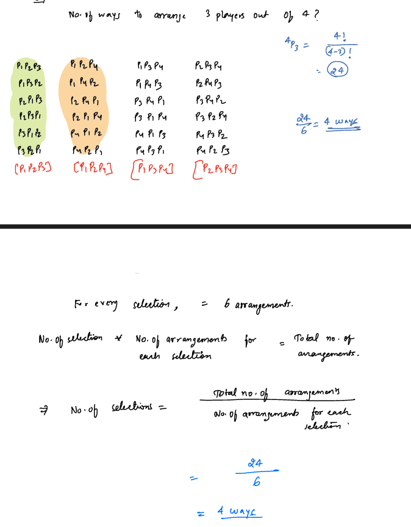

__nCr Formula:__
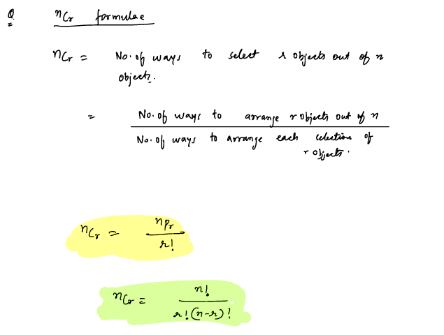

__Combinations Properties:__
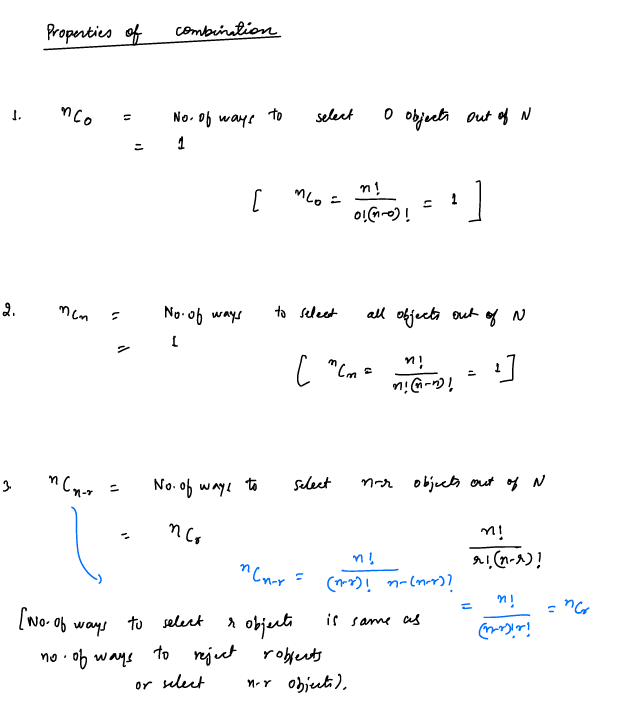

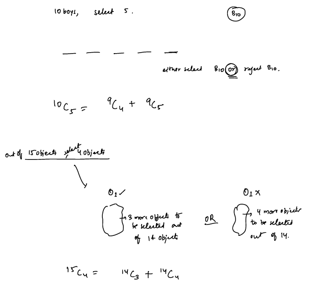
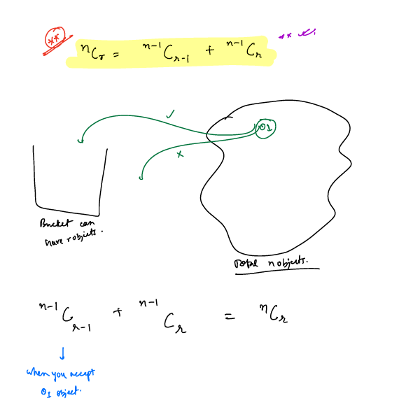


### Problems:
__P1:__ Generate Pascal's Triangle

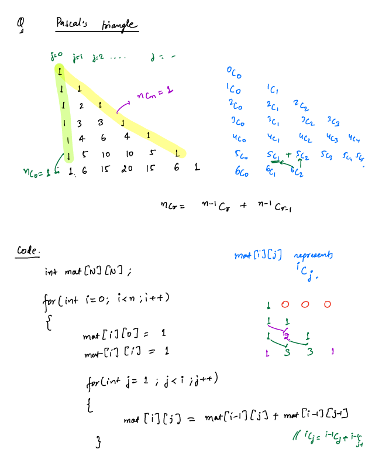

__P2:__ Given a number find the corresponding excel sheet title
````text
1   2   3   4   5   6 . . . 26  27  28 . . . 52  53  54 . . . 
A   B   C   D   E   F . . . Z   AA  AB . . . AZ  AAA AAB . . .  
````
__Approach:__
- Create character mapping with index=0 
````text
0   1   2   3   4   5   6   7   8   9   10  11  12  13  14  15  16  17  18  19  20  21  22  23  24  25 
A   B   C   D   E   F   G   H   I   J   K   L   M   N   0   P   Q   R   S   T   U   V   W   X   Y   Z 
````

- Excel sheet column names starts with index=1
- Given input, we consider it as a base-26 number, so that we can map the number with our character mapping
- Examples, 
````text
 input=22 then to map to our char mapping we decrement by one. 22-1 = 21 => `V`
 input = 28 => 28-1 => 27
 Get the remainder based on 26 base => 27%26 = 1 => B
 If number is greater than base-26 divide by 26 to get second's place for base-26 => 27/26 = 1
 Now calculate respective char for number as same as original number input=1 => 1-1 = 0 => A
 Now Answer should be in reverse order => AB
````
- Examples:
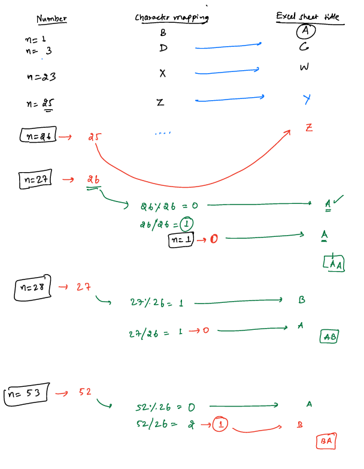
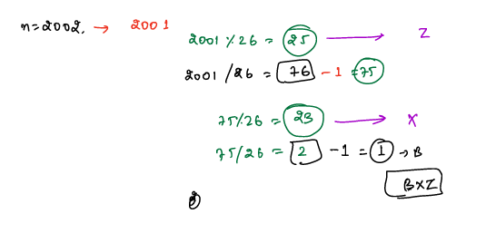

__Code:__
````java
String findExcelTitle(int num){
    StringBuilder ans = new StringBuilder();
    while(num >0){
        //decrement to match zero-index
        num--;
        //0+'A' => A , 1+'A'=>B
        //remainder is always between [0,25] for base-26, if we add 'A' to the number it will give us valid char
        ans.append((char)(num%26+ 'A'));
        num = num/26;
    }
    ans.reverse();
    return ans.toString();
}
````


>[!NOTE]
> Number of ways to arrange n distinct chars = n!
> Num of ways to arrange r chars from n distinct chars => nPr = n!/(n-r)!
> 
