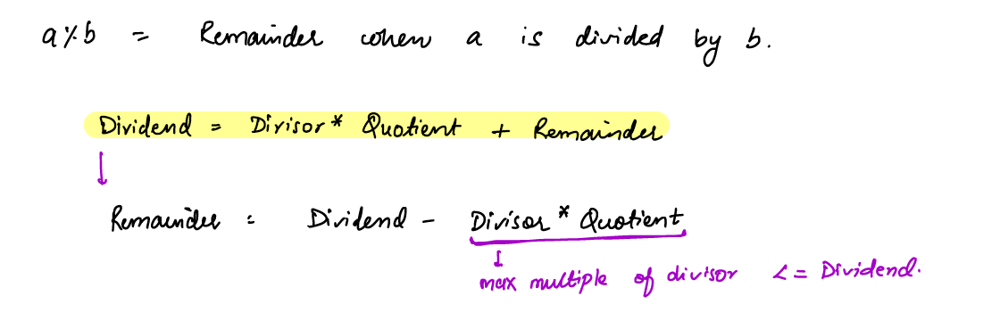
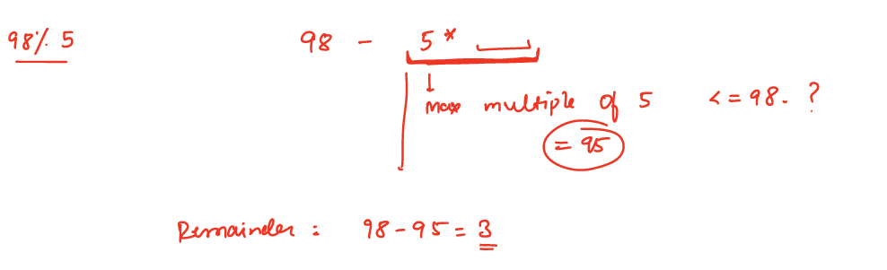
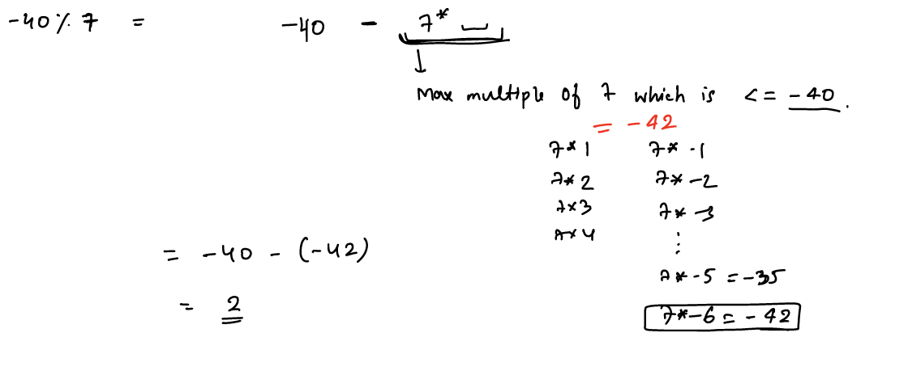
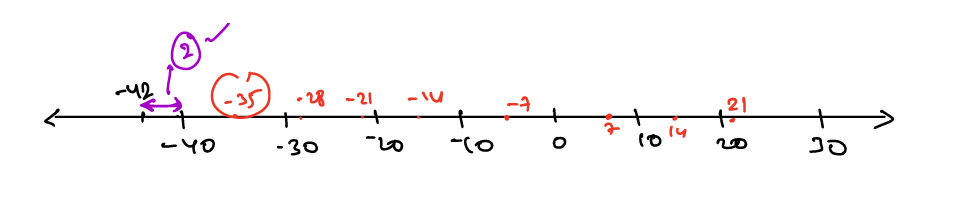
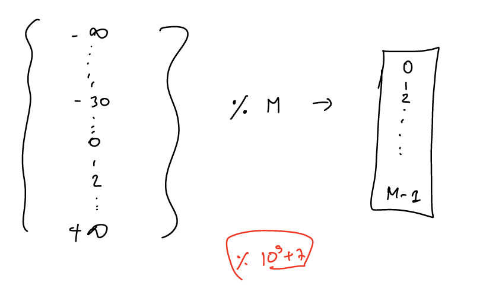
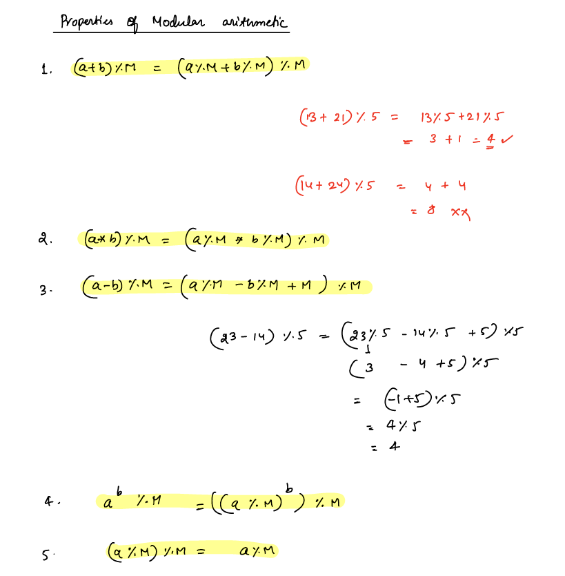
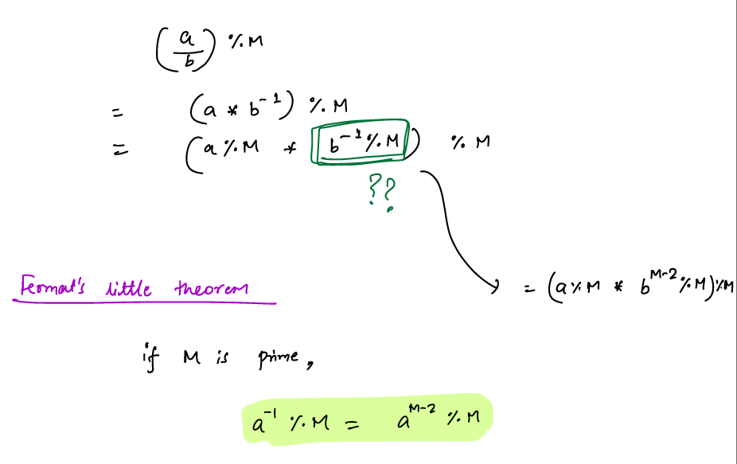
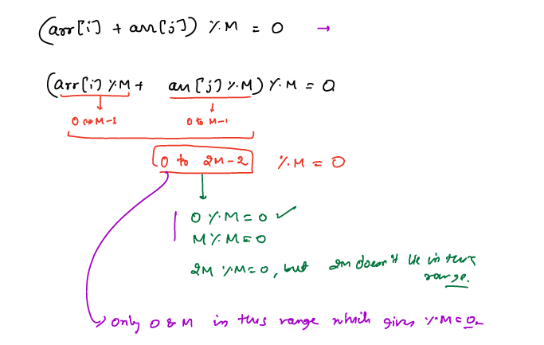
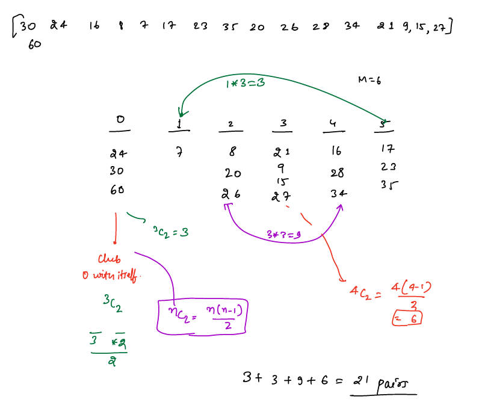

# Modular Arithmetic

- Modulus `%` is an arithmetic operator which helps us find the remainder
- Examples: 
````text
    10%2 = 0 // 2*5 = 10 remainder=10-10 = 0
    10%4 = 2 // 4*2 = 8 remainder = 10-8 = 2
````



### Example-1: Remainder for +ve numbers



### Example-2: Remainder for -ve numbers




- we need a max multiples of 7 where it is <= -40. `-35 > -40` and `-42 < -40`
- So -40-(-42) = -40+42 = 2
- To avoid negative remainders, always add +mod to dividend. Example -40%7 = -5 => -5+7 = 2
##### Observations:
- Divisors & Remainders are always +ve 
- The remainder value is always between [0, Divisor-1]. Example: `?? % 4 = [0, 3]`
- Some of the programming languages gives you a -ve remainder, add a divisor to the result to get the +ve remainder
- Example: `-30 % 7 = -2  this is a -ve remainder,  -2+7 = 5 +ve remainder`
- We are adding divisor so that for negative numbers we reach to <= Dividend

##### Why modulus is used?
- Modulus is used to limit the data in a range.


- Example: if you have the larger int value if you do modulus with `M` then the response will be in range [0, M-1],
- so here we are limiting the data from larger value to [0, M-1]
- Generally mod is kept as large prime number to test the accuracy of the solution example: 10<sup>9</sup>+7 
- If we keep smaller number like `ans % 20` chances of getting collisions are more.


### Properties of Modular Arithmetic:





## Problems
#### P1. Given array elements of size `N`, find the count of pairs i,j such that `(arr[i]+arr[j])%M = 0 where i != j` 
__Example:__
````text
    arr = [4, 3, 6, 3, 8, 12]
    M = 6
    Pairs:
     4+8 = 12%6 = 0
     3+3 = 6%6 = 0
     6+12 = 18%6 = 0
     
     Total pairs = 3
````

__Approach:__



- when will be `(arr[i]%M + arr[j]%M)%M = 0` whenever sum of `(arr[i]%M + arr[j]%M)` is either `0` or `M`, so that `0 % M = 0` or `M % M = 0`

__P1 Example-2:__
````text
    arr = [30, 60, 24, 16, 8, 7, 17, 23, 35, 20, 26, 28, 34, 21, 9, 15, 27]
    M = 6
    
````
- When we do modulo of every number with `M` then we get result value range is between [0, M-1]
- As per the above example `M=6` so we get remainder results [0, 1, 2, 3, 4, 5] 
- As per `(arr[i]%M + arr[j]%M)%M = 0` if we pair remainder's sum equal to either `0` or `M` then we get the pairs count.
- for example, `(0+0)%6 = 0 , (1+5)%6 = 0, (2+4)%6 = 0, (3+3)%6 =0`

- As we need count of pairs we will maintain count based on its remainders
__Code:__
```java
int pairsCount(int[] arr, int M){
    int[] remFreq = new int[M];
    //take a modulus on each number and increment result's index count
    for (int num : arr) {
        remFreq[num % M]++;
    }
    //for num with remainder=0 can only pair with another number whose remainder=0
    // selecting two numbers from total number of items = Nc2 = N(N-1)/2
    int pairCount = (remFreq[0]*(remFreq[0]-1))/2;
    //We use two pointer approach to  find the pairs whose sum=M
    // Number of combinations can be formed => number of elements in i index * number of elements in j index
    int i=1, j=M-1;
    whie(i<j){
        ans = ans+ (remFreq[i]*remFreq[j]);
        i++;
        j--;
    }
    // for M = even then we stop at middle element. for example M=6 then mid = 3 we can only pair with 3 itself
    // choosing 2 elements from N numbers : Nc2 
    if(i == j){
        ans = ans+(remFreq[i]*(remFreq[i]-1))/2;
    }
    return ans;
}
//SC: O(M), TC: O(M+N)
```
