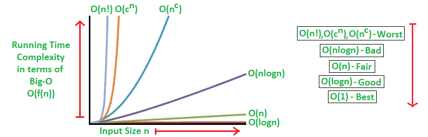
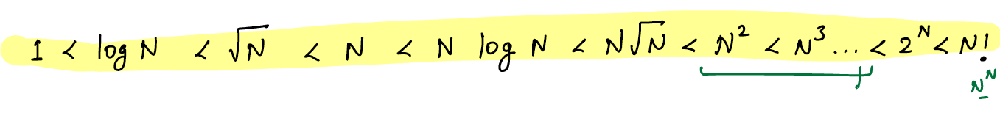
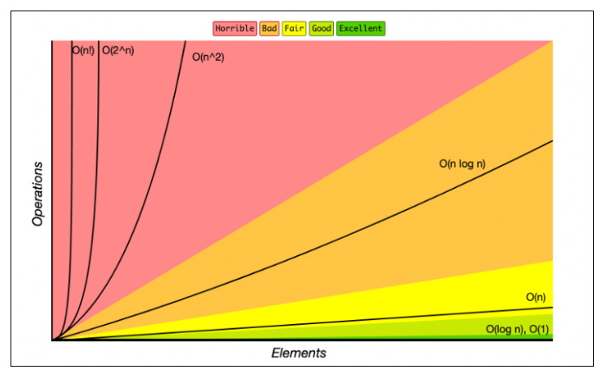

# Time Complexity TC

###### R1====================

Time Complexity:
Time complexity is a type of computational complexity that describes how long it takes for an algorithm to run. It's a function of the length of the input.





One major underlying factor affecting your program's performance and efficiency is the hardware, OS, and CPU you use.

But you don't consider this when you analyze an algorithm's performance. Instead, the time and space complexity as a function of the input's size are what matters.

An algorithm's time complexity specifies how long it will take to execute an algorithm as a function of its input size. Similarly, an algorithm's space complexity specifies the total amount of space or memory required to execute an algorithm as a function of the size of the input.

Big O, also known as Big O notation, represents an algorithm's worst-case complexity. It uses algebraic terms to describe the complexity of an algorithm.

Big O defines the runtime required to execute an algorithm by identifying how the performance of your algorithm will change as the input size grows. But it does not tell you how fast your algorithm's runtime is.

Big O notation measures the efficiency and performance of your algorithm using time and space complexity.

In Big O, there are six major types of complexities (time and space):

Constant: O(1)
Linear time: O(n)
Logarithmic time: O(n log n)
Quadratic time: O(n^2)
Exponential time: O(2^n)
Factorial time: O(n!)



When your calculation is not dependent on the input size, it is a constant time complexity (O(1)).
When the input size is reduced by half, maybe when iterating, handling recursion, or whatsoever, it is a logarithmic time complexity (O(log n)).
When you have a single loop within your algorithm, it is linear time complexity (O(n)).
When you have nested loops within your algorithm, meaning a loop in a loop, it is quadratic time complexity (O(n^2)).
When the growth rate doubles with each addition to the input, it is exponential time complexity (O2^n).


#### How to convert no of iterations to Big-O notation?
1 Get the no of iterations f(n)
2 Neglect lower order terms
3 Ignore constant co-efficients

##### Example:
```text
No of Iterations           Big-O
1000*logn                 O(logn)  // removed constant
4*N^2+ N                  O(N^2) // removed lower order term N + constant-4 
  
```

#### Why do we neglect lower-order terms?
- For example num of iterations = `N^2+N` then will see what is the contribution of `N` for larger input
```text
N               N^2+N       Percentage
1               1+1             50/50
10              100+10          90/10
1000            1000,000+1000   99.999/0.0001

For larger input lower order terms contribution is almost zero, 
so in Big-O notation will ignore lower order terms

```
#### Exponential Time: O(2^n)
You get exponential time complexity when the growth rate doubles with each addition to the input (n), often iterating through all subsets of the input elements. Any time an input unit increases by 1, the number of operations executed is doubled.

The recursive Fibonacci sequence is a good example. Assume you're given a number and want to find the nth element of the Fibonacci sequence.

The Fibonacci sequence is a mathematical sequence in which each number is the sum of the two preceding numbers, where 0 and 1 are the first two numbers. The third number in the sequence is 1, the fourth is 2, the fifth is 3, and so on... (0, 1, 1, 2, 3, 5, 8, 13, …).

This means that if you pass in 6, then the 6th element in the Fibonacci sequence would be 8:

const recursiveFibonacci = (n) => {
if (n < 2) {
return n;
}
return recursiveFibonacci(n - 1) + recursiveFibonacci(n - 2);
};

console.log(recursiveFibonacci(6)); // 8
In the code above, the algorithm specifies a growth rate that doubles every time the input data set is added. This means the time complexity is exponential with an order O(2^n).


▪ Logarithmic algorithm – O(logn) – Binary Search.
▪ Linear algorithm – O(n) – Linear Search.
▪ Superlinear algorithm – O(nlogn) – Heap Sort, Merge Sort.
▪ Polynomial algorithm – O(n^c) – Strassen’s Matrix Multiplication, Bubble Sort, Selection Sort, Insertion Sort, Bucket Sort.
▪ Exponential algorithm – O(c^n) – Tower of Hanoi.
▪ Factorial algorithm – O(n!) – Determinant Expansion by Minors, Brute force Search algorithm for Traveling Salesman Problem.


#### References:
1. https://www.freecodecamp.org/news/big-o-cheat-sheet-time-complexity-chart/
2. 

