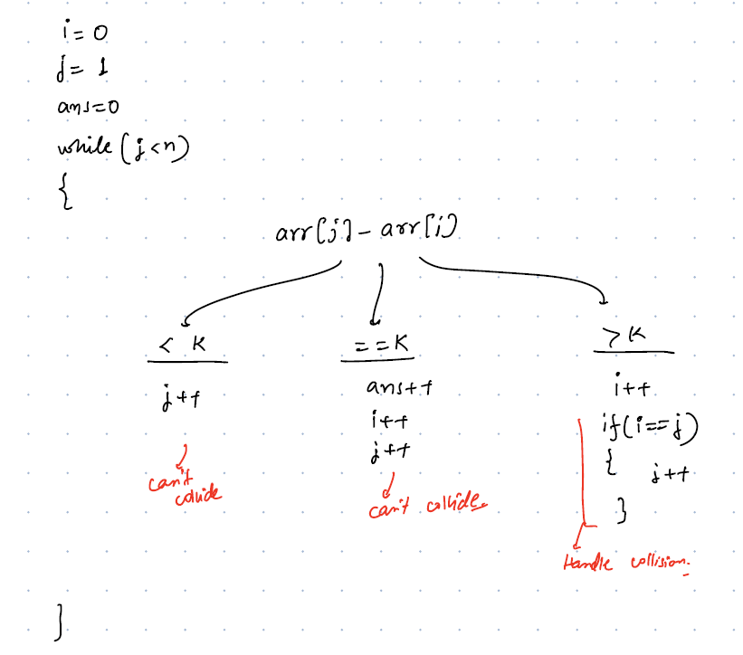

# Two-Pointers 

# two-pointer technique
###### Re-vision-2 ==========1-3-5==============
###### 1
- The two-pointer technique is a pattern in which two pointers iterate across the data structure until one or both of them satisfy the necessary condition.
- Two questions should be clear while using two-pointer approach
        
            1. Where do you place two-pointers initially?
            2. How do you move your pointers?

- **Suitable Data Structures:** Mostly linear DS like Arrays, Linked Lists

### Common patterns of two-pointer approach:
            
            1. Single Array with Two Pointers(start, end)
            2. Two Arrays with Two Pointers (start, start)
            3. Fast and Slow Technique 

#### 1. One pointer starts from beginning and the other starts from an end, they move towards each other until they both meet.

__Example Problems:__
1. Reverse the characters in a string
2. Reverse an array or part of an array
3. Rotate array `K` times


#### 2. One pointer moves at a slow pace while the other pointer moves at a faster pace.

**Example Problems:**
1. Remove duplicates from a sorted array
2. Finding Loop in the Linked List
3.

## When to Use?
1. Whenever a problem involves with reverse or rotation
2. Whenever you are looping through an array multiple times
3. Middle element in the linked list
4. Finding Loop in the Linked List

###### 3
### Sample Questions Explanations:

#### 1. Reverse an array:
- Here we start two pointers, one is from i=0  and another from j=n-1
- we swap (0,n-1) and we increment i++ and decrement j-- until they meet
- **how do we know whether both pointers are met or not?**
- if array size `n is odd` then `i==j` otherwise first pointer crosses second pointer `i>j`

**Pseudo Code**
```java
public int[] reverseAnArray(int[] arr){
    int n = arr.length;
    int i=0;
    int j=n-1;
// swap elements until both pointers meet.
// below loop will be stopped either i==j or i>j        
    while(i<j){
        int temp = arr[i];
        arr[i] = arr[j];
        arr[j] = temp;
        i++;
        j--;
    }
   return arr; 
}

```
#### Two Diff in a Sorted Array:
__Problem:__
````text
Given a sorted array, count pairs i,j such that arr[j] - arr[i] == k 
Examples: 
ar = [ -5 -2 1 8 10 12 15] k = 11 Ans: count =1 (12-1 = 11)
ar = [2, 4, 8] k=1 Ans: 0
````

__Approaches:__
1. Brute Force: two loops
2. Hashmap: finding complement
3. Binary Search:
4. Two-pointers: Optimized
    - Where to start two pointers? i=0, j=1
    - How to move two pointers? Based on the diff value 
````java
var ans =0;
//9-4 = 5 how to decrease diff by subtracting large values 9-5, 9-6,9-7 so here i should be increased
if(arr[j]-arr[i] > k){
    i++;
    //possibility of collisiion ar = [2, 4, 8] k=1 4-2>1 i++ i=4, j=4 we cannot use same element so if i==j then we need to increase j
   if(i == j)
       j++;
}else if(arr[j] - arr[i] < k) { //9-4 = 5 how to increase diff by subtracting from larger values 10-5, 11-6,12-7 so here j should be increased
    j++;
}else { // here we need to handle duplicates also [3, 3,5,6,6,8,8] k=3 
 if(arr[i] == arr[j]){
    int freq = j-i; //freq c 2
    ans += (freq*(freq-1))/2;
 }else {
    var temp1 = arr[i];
    var count1 = 0;
    while(arr[i] == temp1){
        count1++;
        i++;
    }
    var temp2 = arr[j];
    var count2 = 0;
    while(arr[j] == temp2){
        count2++;
        j++;
    }
    ans += (count1*count2);
  }
 
}
````



#### 3. Remove Duplicates from Sorted Array
- For Example, we have an array `[1,1,2,3,4,4,4,4,5]`
- if you start `i=0`, `j=1` and compare `arr[i] == arr[j]` means it is a duplicate
- if it is duplicate then ignore otherwise, add unique number to `i+1`<sup>th</sup> index
- iterate until `j` reaches to end of the array
- return `Arrays.copyOfRange(arr,0,i+1)`

```java
public static int[] removeDupsFromSortedArray(int[] arr){
    if(arr.length ==0 || arr.length ==1){
        return arr;
    }
    int n=arr.length;
    int i=0; // first-pointer which is holding unique element's index
    int j=1; // second-pointer which iterates the array and find the duplicates
    while(j<n){
        if(arr[i] != arr[j]){
            arr[++i] = arr[j];
        }
        j++;
    }
    return Arrays.copyOfRange(arr, 0, i+1);    
}

``` 


###### 5
#### Assignment problems:
1. Reverse an array elements from [startIndex, endIndex]
2. Removing Duplicate Email Addresses from mail group
3. Rotate Array for `K` times
4. Reverse Words in a String
5. [Two Sum II - Input array is sorted](https://leetcode.com/problems/two-sum-ii-input-array-is-sorted/)
6. ** [Container With Most Water](https://leetcode.com/problems/container-with-most-water/)
7. [Product of Array Except Self](https://leetcode.com/problems/product-of-array-except-self/)


##### References:
1. https://leetcode.com/articles/two-pointer-technique/
2. https://www.codingninjas.com/studio/library/what-is-a-two-pointer-technique
3. https://www.baeldung.com/java-two-pointer-technique


