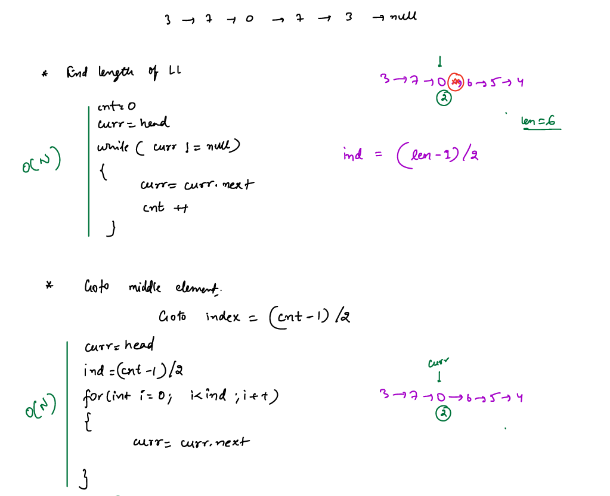
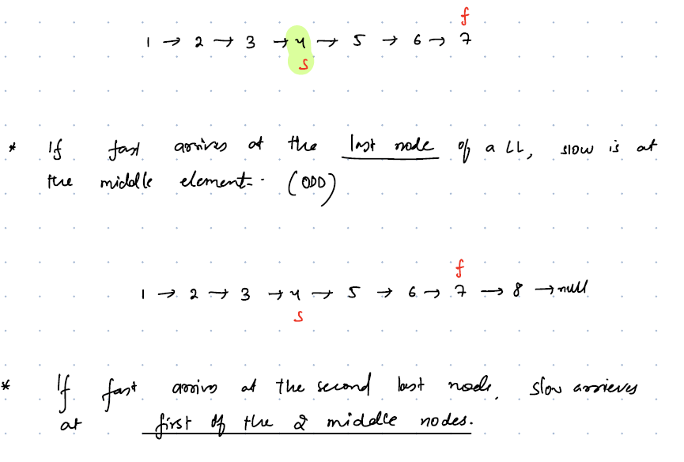
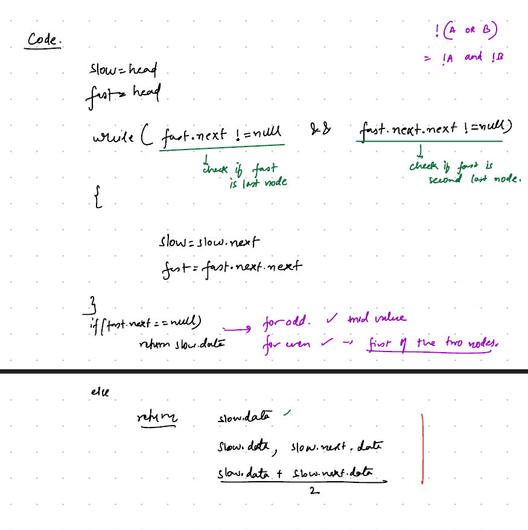

# Linked List Easy Problems Set


<details>
<summary>Q1.Reverse a Linked List:</summary>

__problem statement:__
````text
Given a Head Node reverse the Linked List

````

__Approach:__
- Maintain Two Pointer one for prev and another for navigation
- While moving towards end prev pointer will become head

__code:__
````java
public  static ListNode reverse(ListNode head){
    ListNode prev = null;
    var curr = head;
    while(curr !=null){
        var temp = curr.next;
        curr.next = prev;
        prev = curr;
        curr = temp;
    }

    head = prev;
    return head;
}
````

</details>

___

<details>
<summary>Q2.Find the Middle of Linked List:</summary>

__problem statement:__
```text
Given a Head Node return whether given Linked List is a Palindrome or not

```
__Approaches:__

- If Linked List length is **Odd** then only one node is middle node, otherwise two middle nodes

__1. Finding Length and Dividing (Double-Traversal):__

- Find the length of the linked list
- Diving by 2 to get the middle element 
- Navigate until (len-1)/2 why not len/2 ? For even len we want mid to point for the first middle, if we make (len-1)/2 it works for both use cases.
 
 



__2.Two-Pointers: Fast & Slow Pointer Approach__
 
- The efficient approach is to traverse through the linked list using two-pointers i.e slow pointer and fast pointer. 
- Increment **slow_ptr** by 1 step and **fast_ptr** by 2 steps, As a result, the fast pointer will travel double than that of the slow pointer. 
- So When the fast pointer will reach to the end of the linked list, slow point would still be at the middle of the linked list.




        - Initialize two pointers slow_ptr and fast_ptr and point both of them to the head node.
        - Until fast_ptr is NULL or the next of fast_ptr is NULL, move slow_ptr by one step and fast_ptr by two steps at the same time.
        - As we can see slow_ptr is pointing towards the middle of the Linked List. Hence return the slow_ptr.
__CODE:__





</details>

___

<details>
<summary>Q3.Palindrome:</summary>

__problem statement:__
```text
Given a Head Node return whether given Linked List is a Palindrome or not

```

__Approaches:__

__1. Brute Force:__
- Create a deep copy
- Reverse copied Linked List
- Navigate both linked lists and verify whether all the nodes are same or not.
- TC: O(N) SC: O(N) to hold the deep copy LL

__2. Optimized:__

- Divide the LL into two parts
- Reverse the second part
- compare both the linked lists
- TC: O(N) SC: O(1) No extra space

````java
public static boolean isListPalindrome(ListNode head){
    //find the middle node
    var mid = findMid(head);
    //divide into 2 parts
    var h2 = mid.next;
    mid.next = null;
    //reverse part-2
    h2 = reverse(h2);
    //compare both the parts
    while(h2 != null && head.val == h2.val){
        head = head.next;
        h2 = h2.next;
    }

    return h2 == null;

}
````

</details>

___


