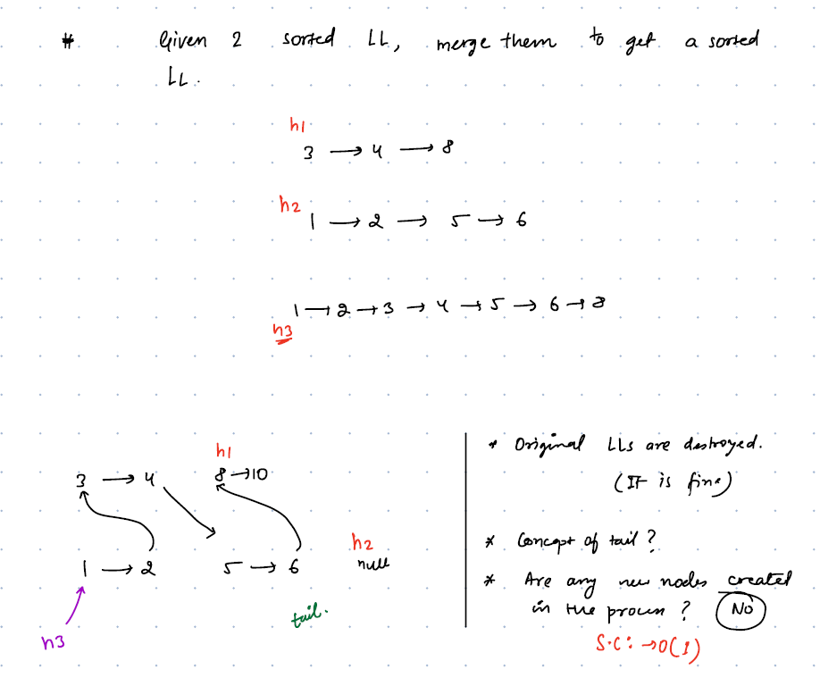
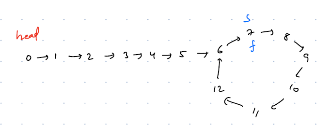
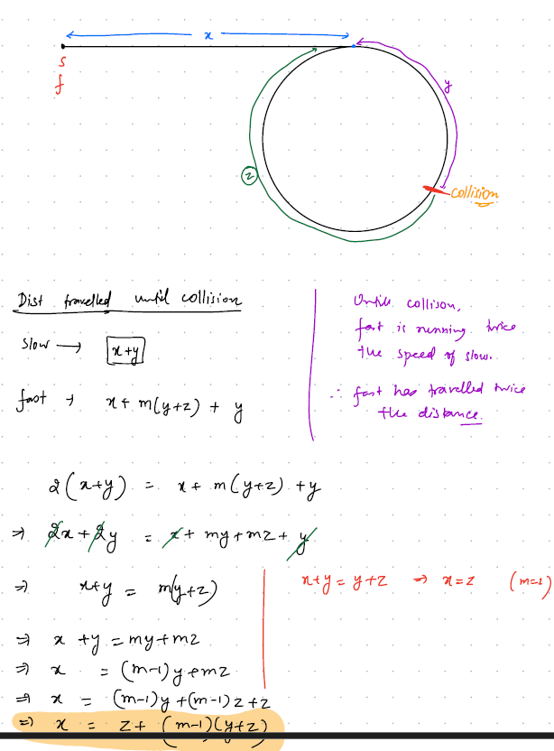
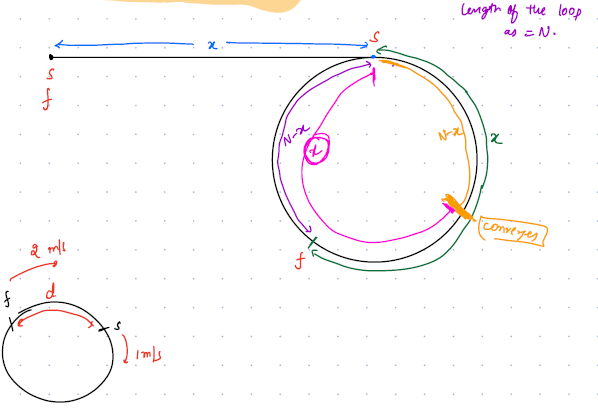

# Linked List Medium Problem Set

<details>
<summary>Q1.Merge Two Sorted Linked List:</summary>

__problem statement:__
````text
Given a Head pointers for two sorted linked lists
Input:

h1 = 1->3->6
h2 = 2->4->5->7

Output: h3 = 1->2->3->4->5->6->7
````

__Approach:__
__1. Brute Force:__
- Create a new linked list with dummy node
- iterate through both the linked lists and compare both of them by Node.val
- Base on comparison add the nodes to new list
- TC: O(N) SC: O(N) to hold the result 

__2. Optimized:__ But LL will be broken



- Take two pointers one is for result head h3 another is a tail pointer, initially assign with dummy node
- Iterate through both the lists, move tail pointer along with the merging.
- Return h3.next to remove dummy node

__code:__

````java
 public  static ListNode mergeSortedList(ListNode h1, ListNode h2){
    var h3 = new ListNode(-1); //Dummy Node
    var tail = h3; //Tail Pointer
    while (h1 != null && h2 != null){
        if(h1.val <= h2.val){
            tail.next = h1;
            h1 = h1.next;
        }else {
            tail.next = h2;
            h2 = h2.next;
        }
        tail = tail.next;
    }
    //Corner Case: Appending non-empty list
    if(h1 == null)
        tail.next = h2;
    if(h2 == null)
        tail.next = h1;

    return h3.next;
}

````


</details>

___

<details>
<summary>Q2.Sort a Linked List:</summary>

__problem statement:__
````text
Given a Head Node sort the Linked List

````

__Approach:__
- The Best way to sort a linked list is by using Merge Sort
- Recursively divide the linked list into two parts until each part has only one element
- Now merge both the list by using merge sort function: `h3 = mergeSortedList(h1, h2)`
-  TC: O(NlogN)  SC: O(logN) for recursive call stacks takes logN calls
- 
__code:__
````java
public  static  ListNode sortList(ListNode head){
    if(head == null || head.next == null)
        return head;
    //Step-1: Divide the Node into 2 parts
    //findMid: by using fast-slow pointer
    var mid = findMiddle(head);
    var h2 = mid.next;
    //disconnect the first part
    mid.next = null;

    head = sortList(head);
    h2 = sortList(h2);

    return mergeSort(head, h2);

}

private static ListNode mergeSort(ListNode h1, ListNode h2) {
    var h3 = new ListNode(-1);
    var tail = h3;
    while (h1 != null && h2 != null){
        if(h1.val <= h2.val){
            tail.next = h1;
            h1 = h1.next;
        }else {
            tail.next = h2;
            h2 = h2.next;
        }
        tail = tail.next;
    }
    if(h1 == null)
        tail.next = h2;
    if(h2 == null)
        tail.next = h1;

    return h3.next;
}

public static ListNode findMiddle(ListNode head){
    var fast = head;
    var slow = head;
    while(fast.next != null && fast.next.next != null){
        fast = fast.next.next;
        slow = slow.next;
    }
    return slow;

}
````

</details>

___

<details>
<summary>Q3.Detect a Loop/Cycle in a Linked List </summary>

__problem statement:__
````text
Given a Head Node check whether loop exists or not. 
If Loop exists remove the loop

````


Q3.1 Check Whether Loops Exist or Not

__Approach:__

__1.HashSet:__
- Create an empty HashSet
- Iterate Each Node checks whether node exists on the hashset or not
- If the current node already exists in the hashset, then loop detected return true otherwise, store the node into hashset.
- If iteration reaches to null, then return false
- TC: O(N) SC: O(N)

````java
public  static boolean isLoopExistsHashSet(ListNode head){
    var set = new HashSet<ListNode>();
    var temp = head;
    while (temp != null){
        if(set.contains(temp)){
            return true;
        }
        set.add(temp);
        temp = temp.next;
    }
    return false;
}
````

__2.Optimized: fast-slow pointer__

- Create two pointers fast and slow
- Move a slow pointer with one node at a time and move a fast pointer with double the speed
- At some point both pointers meet



```java
public  static boolean isLoopExistsFastSlowPointer(ListNode head){
    var slow = head;
    var fast = head;    
    while (fast != null && fast.next != null){
        fast = fast.next.next;
        slow = slow.next;
        if(slow == fast)
            return true;
    }
    
    return false;
}
```

Q3.2 Remove the Loop in a Linked List

- Same approaches as detecting loop
- After detecting the loop keep slow pointer at same position and assign fast=head then move both pointers at same speed(1 node at a time), both pointers meet at starting node of the loop

__summary:__
1. Run fast and slow
2. Both Meet at X
3. Keep slow at X and move fast=head, run both at same speed (1 node at a time).
4. wherever they collide again, that is the start point
5. To remove loop maintain a prev pointer once both pointers meet do prev.next=null to break the loop

````java
public static void detectAndBreakLoop(ListNode head){
    var fast = head;
    var slow = head;

    while (fast != null && fast.next != null){
        fast = fast.next.next;
        slow = slow.next;
        if(slow == fast){
            //Loop Exists Need to Break it
            fast = head;
            var prev = slow;
            while (slow != fast){
                prev = slow;
                slow = slow.next;
                fast = fast.next;
            }
            System.out.println("Loop Detected at Node: "+slow.val);
            prev.next = null;
            return;
        }

    }
    System.out.println("Loop Doesnot Exists.");
}
````
- How does it meet at loop beginning node?
- See the Explanation Below






</details>

___
