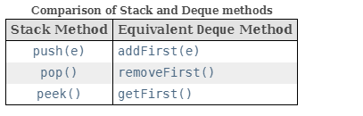

# Stacks

###### ========================= Revision-1 =============================

- A stack is a linear data structure that follows the Last-In-First-Out (LIFO) principle. 
- It behaves like a stack of plates, where the last plate added is the first one to be removed.

### Operations:
- All the Operations should be supported in O(1) time

__Push:__ Adds an element to the top of the stack.

__Pop:__ Removes the top element from the stack.

__Peek:__ Returns the top element without removing it.

__IsEmpty:__ Checks if the stack is empty.

__IsFull:__ Checks if the stack is full (in case of fixed-size arrays).

#### Applications of Stack in Data Structure

__1. In code editors:__ Stacks are used in various code editors like VS Code, Atom, etc. to match the opening & closing tags in the languages like HTML, XML, etc.

__2. In matching bracket pairs:__ This is one of the most famous application of stack in data structure. Stacks help us in identifying if the bracket pairs in a sentence or string are complete or missing.

__3. In browsers:__ You are reading this article in your web browser, what will happen if you press the back button present at the left-hand corner of your screen? It would take you back to your last visited website or link. It is done using stacks. Every time you visit a new link, it is stored in the stack. And, every time you press the back button, the current link is popped out from the lifo stack, and the previous link is made available.

__4. In compilers:__  Stacks are used heavily by the browsers to convert infix expressions to postfix expressions. It is done because the compilers can not read an expression directly. E.g., if there is an expression – 5 + (1 + 4/2), the compiler cannot process it like humans. Thus, it solves this expression by converting it into a postfix or prefix expression

#### Stacks in Java Collection Framework:

#### Prioritize use of Deque over Stack :
- The Stack class in Java is a legacy class and inherits from Vector in Java.
- It is a thread-safe class and hence involves overhead when we do not need thread safety. 
- It is recommended to use ArrayDeque for stack implementation as it is more efficient in a single-threaded environment.

__Deque is Used as Stack:__

- Deques can also be used as LIFO (Last-In-First-Out) stacks. This interface should be used in preference to the legacy Stack class.
- When a deque is used as a stack, elements are pushed and popped from the beginning of the deque. Stack methods are equivalent to Deque methods as indicated in the table below:

- Unlike the List interface, this interface does not provide support for indexed access to elements.

__ArrayDeque:__
- Resizable-array implementation of the **Deque** interface.
- ArrayDeques have no capacity restrictions
- **_Null elements are prohibited._**
- This class is likely to be faster than Stack when used as a stack, and faster than LinkedList when used as a queue.
- Best suitable for Stack & Queue Operations.

#### When to use Stacks in problems?
- Balalnced Pare, If you feel, any two adjacent characters to be ruled out then we can use Stacks
- Examples:
  - If both the characters are same we want to cancel each other Ex question: Double Character Trouble- `abbaaccd`
  - If adjacent compliments needs to be cancelled out Ex question: Balanced Parentheses- `( [{()}])`
  - Expression Evaluation: Infix to Postfix, Infix to Prefix, Postfix to solution ... etc
  - Nearest Smaller/greater element in the left or right side of the array always think of Stacks
  - 