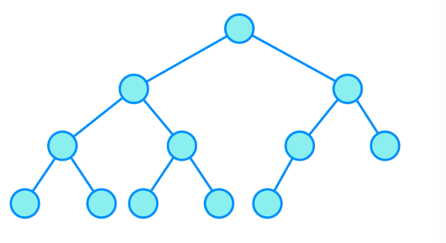
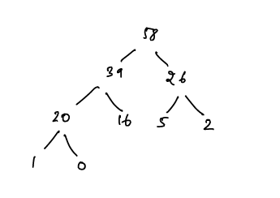
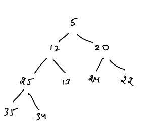
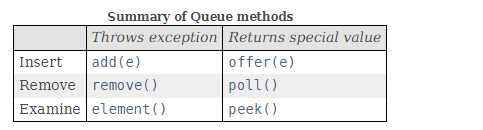
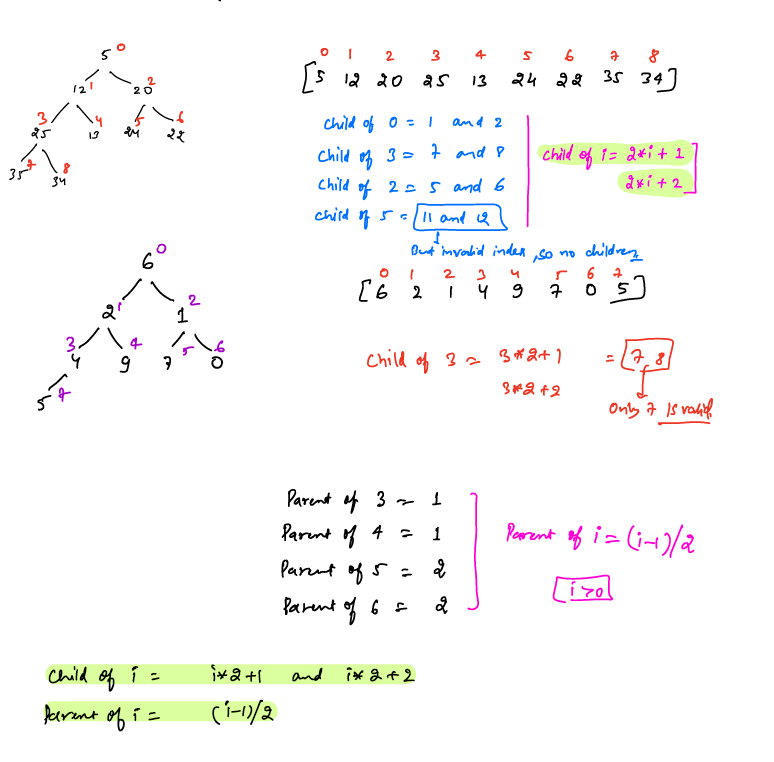

# Heaps:

- A Heap is a complete binary tree data structure that satisfies the heap property.

__Complete Binary Tree:__

- A binary tree is called complete binary tree when all the levels of binary tree are filled except possibly the last level, which is filled from the left to right order.
- The Difference between a complete binary tree and a full binary tree is that, in a complete binary tree, all leaf nodes should lean towards a left and the last nodes need not have a right sibling.



- All the levels except the last level are completely full.

__Heap Property:__

- This property makes sure that the root node contains the **maximum** or **minimum** value (depending on the type of heap), and the values decrease or increase as you move down the tree.
-  Heaps are usually used to implement priority queues, where the smallest (or largest) element is always at the root of the tree.

__1. Max Heap:__ The root node contains the maximum value, and the values decrease as you move down the tree.

- Every Parent node value is greater than or equal to child nodes

 


__2.Min Heap:__ The root node contains the minimum value, and the values increase as you move down the tree.

- Every parent node value is lesser than or equal to child nodes.




### Heap Operations:

- __Insert:__ Adds a new element to the heap while maintaining the heap property.

- __Extract Max/Min:__ Removes the maximum or minimum element from the heap and returns it.

- __Heapify:__ Converts an arbitrary binary tree into a heap.
  
##### Java Methods
- Same as Queue methods:


````java
PriorityQueue<Integer> minHeap = new PriorityQueue<Integer>();
PriorityQueue<Integer> maxHeap = new PriorityQueue<>(Comparator.reverseOrder());
````

- By default, **PriorityQueue** is a Min Heap

````java
public boolean offer(E e); //Inserts the specified element into this queue if it is possible to do so immediately without violating capacity restrictions. When using a capacity-restricted queue, this method is generally preferable to add(E), which can fail to insert an element only by throwing an exception.
public E poll(); //Retrieves and removes the head of this queue, or returns null if this queue is empty.
public E peek(); //Retrieves, but does not remove, the head of this queue, or returns null if this queue is empty.

//Other methods which throws Exceptions for the same functionality
public boolean add(E e); //Inserts the specified element into this queue if it is possible to do so immediately without violating capacity restrictions, returning true upon success and throwing an IllegalStateException if no space is currently available.
public E element(); // same as peek() but NoSuchElementException - if this queue is empty
public E remove(); //same as poll() but NoSuchElementException - if this queue is empty
````



- __Implementation note:__ 
- enqueuing and dequeuing methods(offer, poll, remove() and add) :  **O(log n) time** 
- remove(Object) and contains(Object) methods: **O(n)** 
- retrieval methods (peek, element, and size): **O(1)**

- __Heapify:__ Heapifying while insert and while removing the element takes O(logn).
- __Build Heap:__ To build heap from an entire array it takes O(n) time, if you build heap by inserting one element at a time then it takes O(nlogn)

### Heap Data Structure Applications

- Heaps are commonly used to implement priority queues, where elements are retrieved based on their priority (maximum or minimum value).
- Heapsort is a sorting algorithm that uses a heap to sort an array in ascending or descending order.
- Heaps are used in graph algorithms like Dijkstra’s algorithm and Prim’s algorithm for finding the shortest paths and minimum spanning trees.


## Implementation of Heaps:

- we can use an **array** to implement a complete binary tree. 
- Check the below image on how to define child and parents of a complete binary tree inside the array




#### 1. Insertion in a min heap:
- At each insertion, node is inserted at the last(n-1 index of the array) and it moves upward by swapping with its parent until heap order is satisfied.
- Traversing the height: **O(logn)**
