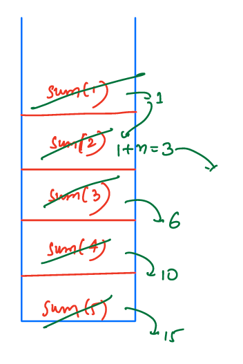
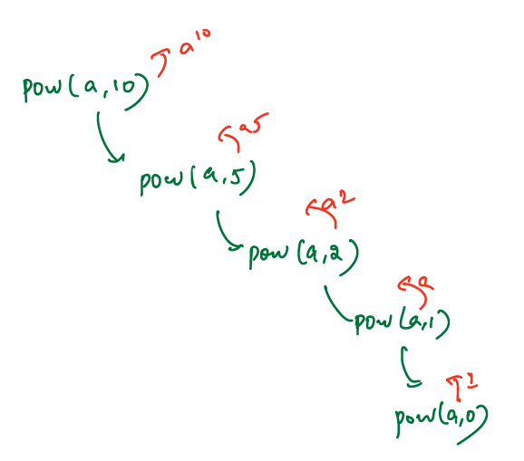
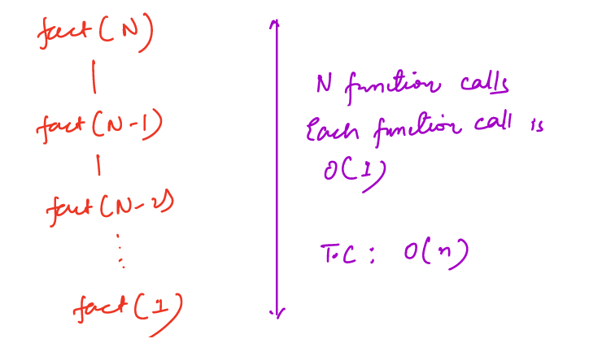
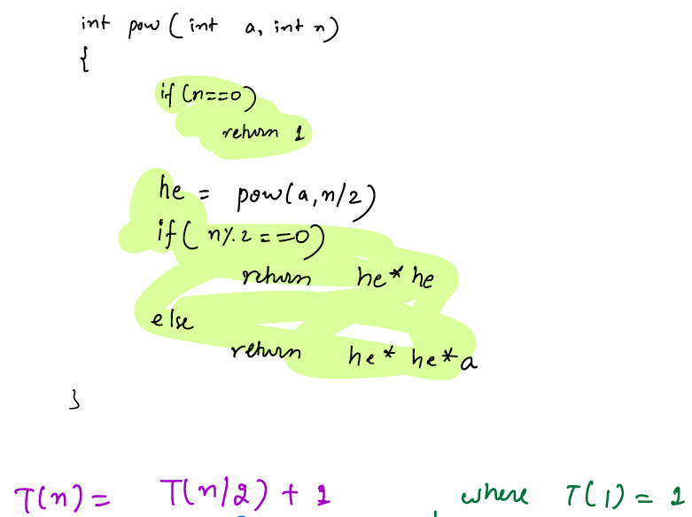
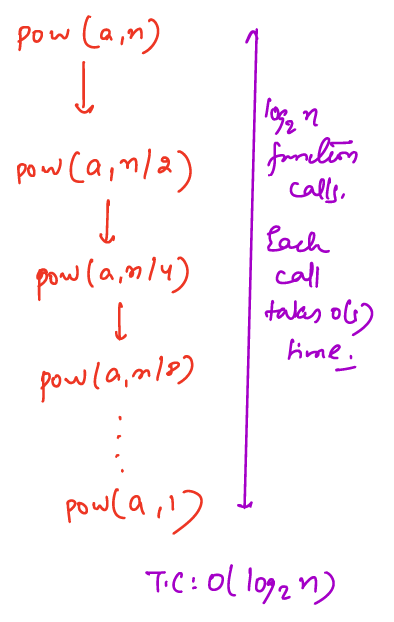
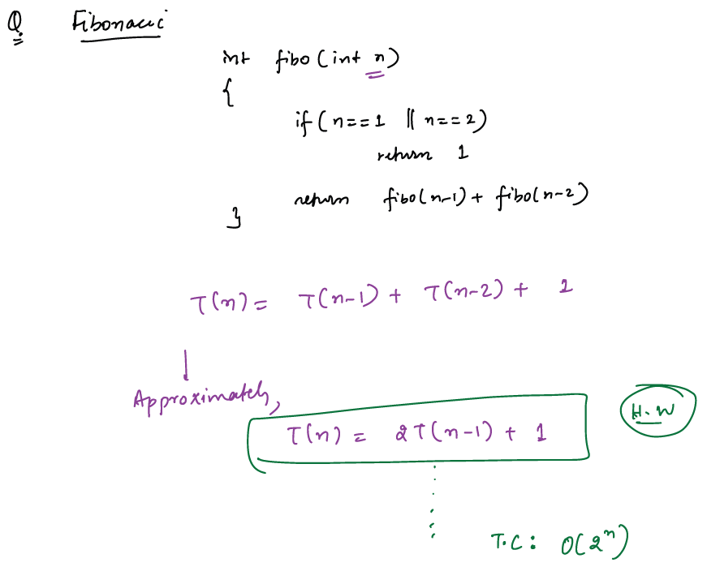
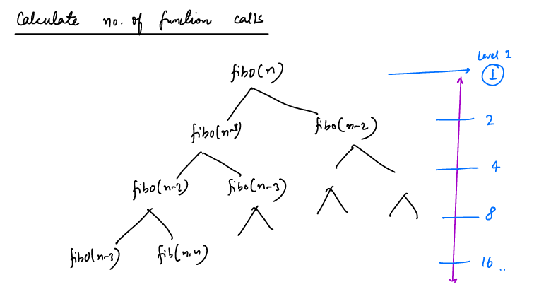
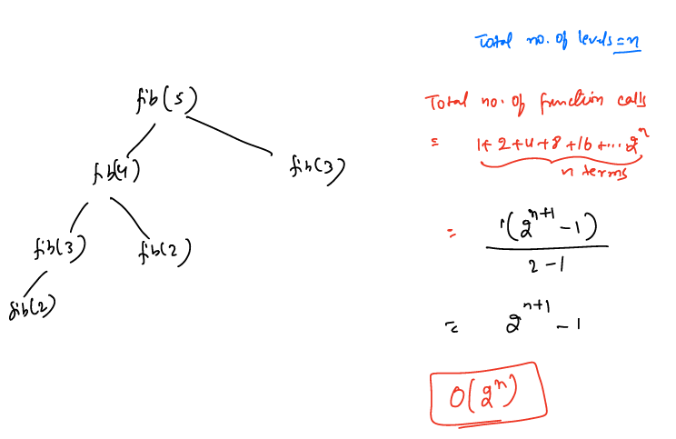

###### R1--1--3--5---
- [X] update from class notes
- [X] Add at least 3 examples
- [ ] Add at least 5 problems with different variations
- [ ] Go through References and update notes if required
---
# Recursion:

- Recursion is a process where a function calls itself directly or indirectly to solve a problem.
- It involves breaking a problem down into smaller and smaller sub problems until you get to a small enough problem that it can be solved trivially.
- Let's understand with an example:
- Sum of `N` natural numbers
```text
    Sum(N) = 1 + 2 + 3 + 4 + 5 + .............+ N-2 + N-1 + N
    Can we write this same as Sum(N) = Sum(N-1) + N
```
- If we know sum(N-1) then by simply adding `N-term` will give us sum of `N` natural numbers
- Here smallest sub-problem which we know already is `Sum(1) = 1`

### How to write a Recursion Code?
There are 3-steps to write any Recursion code
##### 1. Assumption/Faith:
- Define your function what it should do
- Have an ultimate faith in that function, that it is doing what it should do OR it works as expected.
##### 2. Main Logic:
- How to solve an original problem using sub-problems
##### 3. Base Condition:
- When  should your recursion should stop? OR
- What is the smallest sub-problem which we already know of?
- Base Condition should always be top of the method
___

### Examples:
#### Example-1. Sum of N natural numbers
- Assumption: `int sum(int n):` this method return sum of `N` natural numbers and it is working as expected
- Main Logic: `sum(n) = sum(n-1)+n`
- Base Condition: `sum(1) = 1`
##### Pseudo Code:
```java
//function definition
int sum(int n){
    //Base Condition
    if(n ==1){
        return 1;
    }
    //main logic
    return sum(n-1)+n;
}
```

##### How it works internally?
- Let us understand for sum(5)



#### Example-2. Find Nth term from fibonacci series
- Fibonacci Series: `0 1 1 2 3 5 8 13 21 34 55 . . . . . . .`
- `fibonacci(n) = fibonacci(n-1) + fibonacci(n-2)`
- To calculate any fibonacci term first we need to know what are the `n-1` and `n-2` terms
- Base Condition: fibonacci(1) = 0 and fibonacci(2) = 1
##### Pseudo Code
```java
int fibo(int n){
    if(n==1)
        return 0;
    if(n == 2)
        return 1;
    return fibo(n-1)+fibo(n-2);
}
```
#### Example-3. Fast Power Function:  pow(a,n) = a<sup>n</sup>
- a<sup>n</sup> = `a*a*a*a*a*a*a*a....*a*a = n-times of a`
- a<sup>n</sup> = a<sup>n-1</sup> * a
- Smallest sub-problem a<sup>0</sup> = 1

##### Code
```java
int pow(int a, int n){
    if(n ==0)
        return 1;
    return pow(a,n-1)*a;
}
```

**Observations:**
- in this problem we even divide the problem by half i.e  a<sup>n</sup> = a<sup>n/2</sup> * a<sup>n/2</sup>
- As we calculate for first half we don't need to calculate for second half why because there is no change on input.
- If n==even then a<sup>n</sup> = a<sup>n/2</sup> * a<sup>n/2</sup> otherwise, a<sup>n</sup> = a<sup>n/2</sup> * a<sup>n/2</sup> * a
- Example:
  - a<sup>10</sup> = a<sup>5</sup> * a<sup>5</sup>
  - a<sup>11</sup> = a<sup>5</sup> * a<sup>5</sup> * a

##### Optimization:
```java
int pow(int a, int n){
    if(n ==0)
        return 1;
    int halfEval = pow(a, n/2); 
    if(n%2 == 0)
        return halfEval * halfEval;
    else
        return halfEval * halfEval * a;
}
```
##### Dry-run:
- Dry run for n=10




<details>
<summary> How to calculate Time Complexity (TC) ? </summary>

### How to calculate Time Complexity (TC) ? 
There are two ways to calculate TC for recursion solutions

    1. Recurrence Relation Technique
    2. Function Call Tracing


#### 1. Recurrence Relation Technique
- Read the code and derive recurrence equation from method implementation
- Solve that equation until we get generalized equation
- Try to get rid of `K` by using base condition
- Finally, solve and apply Big-O notation on final equation

##### Examples:
1. find TC for factorial of a number:
##### Code
```java
int fact(int n){
    if(n ==0)
        return 1;
    return n*fact(n-1);
}
```
- In fact(n) method If we assume time taken by function is T(n) then time equation is `T(n) = T(n-1)+1`
- Last one is for constant time to execute base condition and return statement
- For base condition: T(0) = 1
- Generalize Equation:
```text
    T(n) = T(n-1)+1     T(0)=1
    // calculate T(n-1) by place n = n-1 
    T(n-1) = T(n-1-1)+1 = T(n-2)+1
    //apply T(n-1) on T(n)
    T(n) = (T(n-2)+1) + 1 = T(n-2)+2 // T(n-2) = T(n-3)+1
    T(n) = T(n-3)+3
    //Generalizing the equation:
    T(n) = T(n-k)+k
    // Get rid of K by using base condition T(0) = 1
    // To map T(n-k) to T(0) we need to find K value to so that if we substitute K in eq T(n-k) will be T(0)
    n-k = 0
    n = k
    // apply k=n on Time equation
    T(n) = T(n-n)+n = T(0)+n = 1+n
    //Apply Big-O notation
    O(T(n)) = O(n+1) = O(n)
    
```
- TC for fact(n) is O(n)
#### 2. Function call Tracing:
- Calculate the number of function calls happening and time taken by each function call.
- Example:



- In fact(n) each function takes constant time to execute base condition and return statement and it is called for n times.
- So n-times * 1 = n => TC = O(n)
##### Example-2: Calculate TC for Fast power function:
1. Recurrence Relation Approach:



- Equation:

````text
  T(n) = T(n/2)+1   T(1) = 1
        T(n/2) = T((n/2)/2)+1 = T(n/4)+1
  T(n) = T(n/4) + 1 + 1 = T(n/4)+2
        T(n/4) = T((n/4)/2) + 1 = T(n/8)+1
  T(n) = T(n/8) + 3
  T(n) = T(n/2^k) + k
  n/2^k = 1 => n = 2^k => k = logn
  //apply
  T(n) = T(n/2^logn)+logn => T(n/n)+ logn => logn+1
  TC: O(logn)
  
````
2. Function Call Tracing:



##### Example-3: Calculate TC for fibo(n)
1. Recurrence Relation Technique


2. Function Call Tracing:





##### TC Assignments:

    1. T(n) = T(n/2) + 1           T(1) = 1
    2. T(n) = 2T(n/2) + 1          T(1) = 1
    3. T(n) = T(n-1) + 1           T(1) = 1
    4. T(n) = 2T(n-1) + 1          T(1) = 1
    5. T(n) = T(n/2) + n           T(1) = 1
    6. T(n) = 2T(n/2) + n          T(1) = 1

</details>

<details>
  <summary>How to calculate Space Complexity (SC)</summary>

### How to calculate Space Complexity (SC)?
- Can recursive code ever take O(1) space?
- No, because stack memory is always used.
- SC is determined by the maximum number of function calls in the call stack at any point of time
- It will be the height of the recursive tree
##### Example-1. Find SC for factorial of a number
- In the factorial function call tracking, we can see that during the execution of fact(1) there will be n-function calls on stack
- So in the worst case, SC = O(n)

  
##### Example-2: Find SC for find n-term of fibonacci series:
- There are n-function calls will be there during the execution of leaf functions
- So in the worst case: SC = O(n)

  

</details>

- Examples of Recursive algorithms: Merge Sort, Quick Sort, Tower of Hanoi, Fibonacci Series, Factorial Problem, etc.
___
### Problems:
1. [Tower of Hanoi](../problems/1.TowerOfHanoi.md)
2. 
3. 
##### References:
1. https://www.geeksforgeeks.org/introduction-to-recursion-data-structure-and-algorithm-tutorials/
2. Watch Tower of Hanoi Animation: https://towersofhanoi.info/Animate.aspx
3. https://www.geeksforgeeks.org/iterative-tower-of-hanoi/
