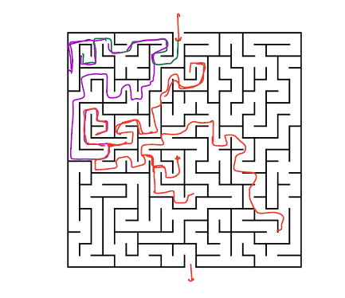
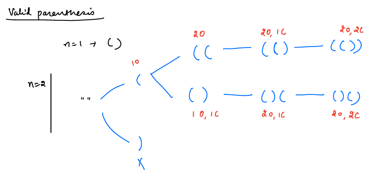
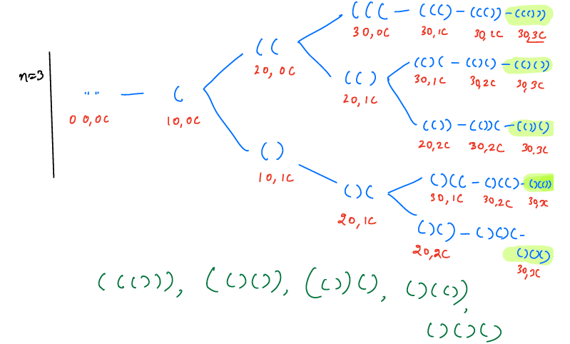

###### R1---1-3-5
- [ ] Add Concept with clear definition
- [ ] Add least 3 examples to understand better
- [ ] Solve at least 5 problems to get hands on
###### TODO
- [ ] add a dry run notes for Example-1
- [ ] add notes for how to find TC and SC

# BackTracking
- Backtracking is concept of exploring all the possible solutions using recursion
- Returns immediately when it is not a possible candidate
##### Example-1: solving a maze is the best example for backtracking


- In the above diagram, we start from point-A then we start exploring all the possibilities to reach point-B
- If we hit the wall immediately, we will return and search for another way to reach point-B
- We try all the possibilities until we reach point-B

##### Example-2: Searching for a word in a tree


- In the above tree example, we are searching for word `AIR`
- We visit all the branches to find the word `AIR`, if we find a branch may not contain then immediately return and search on another branch and soon.
- Search until we find word or all branches of tree are completed
___

### Examples
#### Example-1: Generate Valid Parentheses
__Problem Description:__
Given `N` print all possible valid parentheses of length `2N`
````text
    N =1    Output: ()
    N=2     Output: ()(), (())
    N=3     Output: ((())), ()(()), (())(), (()()), ()()()
````
- Finding count of possible valid parenthesis is another question called: Catalan numbers
- In this problem, we have to print all possible parentheses

__Solution:__
- Start to think of building parenthesis for `N=2` from empty string

    

- Initially we will have empty string then we have only one option is to open parenthesis, why because start with close parenthesis is invalid
- once we open parenthesis we have two options either close or open another until we reach `N`
- We can close parenthesis if the number of open parenthesis is more than close parenthesis

- Similarly for `N=3`


- from the above recursion trees we can draw some observations
- Initially, we can only use open parenthesis
- To generate valid parenthesis will have two choices, at any point of time
    1. add an open parenthesis => you can take this choice only `if(open<N)`
    2. add a closed parenthesis => you can take this choice only `if(close<open)`

__Code__
- Before writing the code first we need to identify definition and do we need to maintain any state of the problem while solving or not?
````java
public static void main(String[] args) {
    //number of pairs we need to generate
    int n=3;
    //to maintain the state of the problem.
    //how many opened and closed till now
    int openCount=0, closeCount=0;
    //to maintain forming parenthesis
    String temp ="";
    //why not StringBuilder? if we use StringBuilder then while backtracking we may loose it's state for another possibililty
    //if we use StringBuilder then we keep on append and remove last char from it to achieve valid response.
    
    backtrack(n, temp, openCount, closeCount);
}

public void backtrack(int n, String temp, int openCount, int closeCount){
    if(openCount+closeCount == 2*n){
        System.out.println(temp);
        return;
    }
    if(openCount < n)
        backtrack(n, temp+"(", openCount+1, closeCount);
    
    if(closeCount < openCount)
        backtrack(n, temp+")", openCount, closeCount+1);
}
//TC:  O(2^n) 2-branches at each step and n-levels
//SC: O(n) at max n function calls in call stack
````
- Dry-Run and TC and SC


### TC and SC

