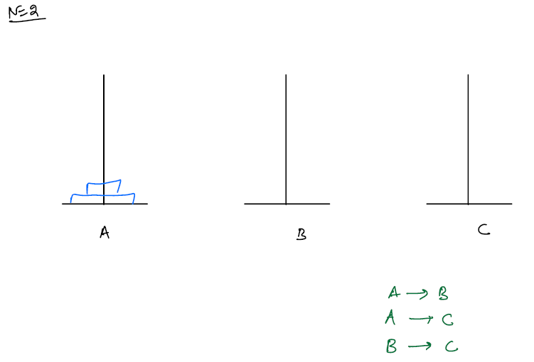

## Tower of Hanoi:
There are `N` disks placed on Tower-A, Move all the disks from Tower-A to Tower-C, using Tower-B if need.

Constraints:
1. Only one can be moved at a time
2. A disk cannot be placed on top of a smaller disk. means(always larger disk should be at bottom)
   Input:
   
   Expected Output:
   

**Solution:**
- If N=1, means only one disk on Tower-A then we can directly move it to Tower-C
- If N=2,



- If we have two disks on Tower-A we take the help of Tower-B
- First we move Tower-A top disk to Tower-B then move the last disk from Tower-A to Tower-C and then move small disk from Tower-B to Tower-C

- If N=3
  
- Step-1: Move top two disks to Tower-B via Tower-C i.e: A->C, A->B, C->B
- Step-2: Move last disk from Tower-A to Tower-C
- If N=4
- Step-1: A->B,A->C,B->C,A->B,A->C =>after this step towers look like below
  
- Now the logic to move 3 disks from Tower-B to Tower-C via Tower-A is the same as N=3

Observations:
- Based on `N` disks value, temp tower will be exchanging among all the towers

##### Code:
```java
void main(){
    int n = 3; // number of disks
    char tA = 'A'; // tower-A
    char tB = 'B'; // tower-B
    char tC = 'C'; // tower-C
    toh(n,tA, tC,tB);
}
void toh(int n, char src, char des, char temp){
    if(n == 1){
        System.out.println(src+"->"+des);
        return;
    }
    //move top n-1 disks from src to temp tower
    toh(n-1,src,temp,des);
    //move last disk from src to des tower
    toh(1,src,des,temp);
    //move n-1 disks from temp to des via src
    toh(n-1,temp,des,src);
}
```

##### Dry-Run:
- If N>1 the every time 3 function calls will be made
    1. move n-1 disks from src to temp
    2. move n-th disk from src to des
    3. move n-1 disks from temp to des
- If N=1:
````text
  toh(1,tA,tC,tB) -> print -> A->C
````
- If N=2:
````text
//move n-1 disks to temp
toh(2, tA, tC, tB) -> toh(1,tA,tB,tC) -> print: A->B
//move last disk to des
-> toh(1,tA,tC,tB) -> print: A->C
//move n-1 disk from temp to des
toh(1,tB,tC,tA) -> print: B->C
````
- If N=3:
````text
toh(3,A,C,B)
// move n-1 disks to B
toh(2,A,B,C) 
//move n-th disk to des
toh(1,A,C,B)
//move n-1 disks from temp to des 
````

##### TC & SC of Tower of Hanoi:

