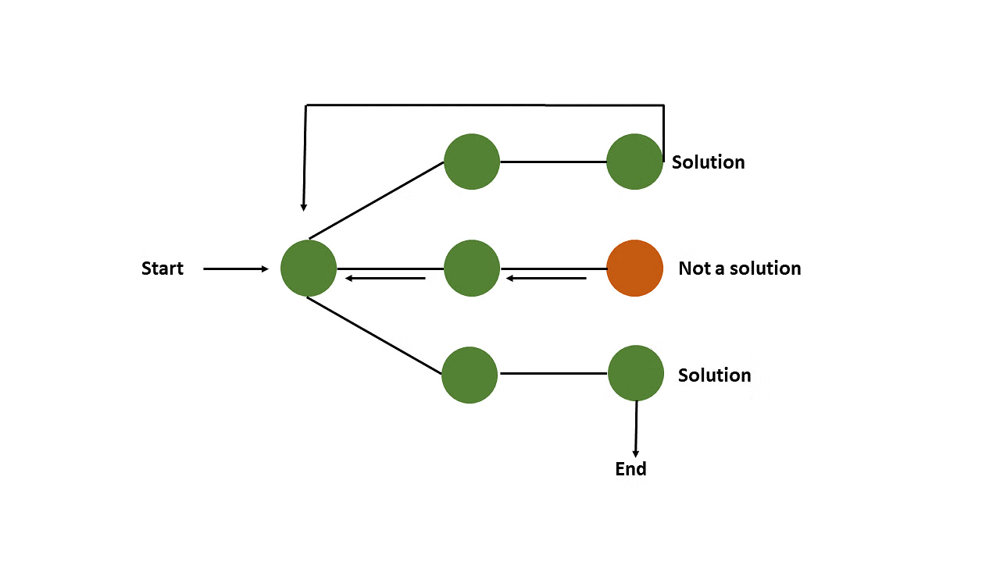
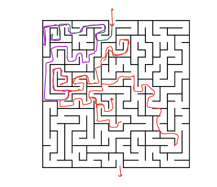
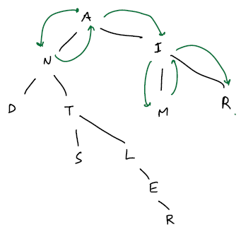
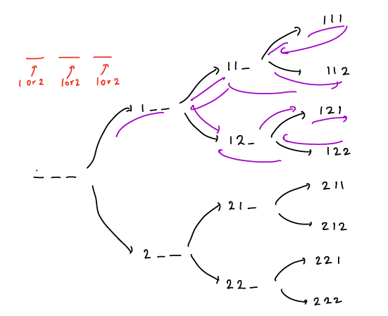
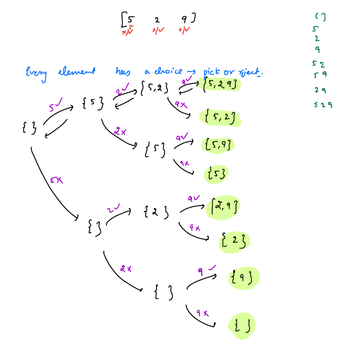

###### R1---1-3-5
- [ ] Add Concept with clear definition
- [ ] Add least 3 examples to understand better
- [ ] Solve at least 5 problems to get hands on
###### TODO
- [ ] add a dry run notes and TC, SC calculation details for all the problems.

---

# BackTracking
- Backtracking is a kind of brute-force approach where we explore all the possible solutions using recursion, and it returns immediately when it is not a possible candidate

//R2 TODO:

- Backtracking is an algorithmic technique whose goal is to use brute force to find all solutions to a problem. It entails gradually compiling a set of all possible solutions. Because a problem will have constraints, solutions that do not meet them will be removed.
- It finds a solution by building a solution step by step, increasing levels over time, using recursive calling. A search tree known as the state-space tree is used to find these solutions. Each branch in a state-space tree represents a variable, and each level represents a solution.
- A backtracking algorithm uses the depth-first search method. When the algorithm begins to explore the solutions, the abounding function is applied so that the algorithm can determine whether the proposed solution satisfies the constraints. If it does, it will keep looking. If it does not, the branch is removed, and the algorithm returns to the previous level.

### State Space Tree:
State-Space Tree
A space state tree is a tree that represents all of the possible states of the problem, from the root as an initial state to the leaf as a terminal state.



A "space state tree" is the above tree representation of a problem. It represents all possible states of a given problem (solution or non-solution).
https://www.simplilearn.com/tutorials/data-structure-tutorial/backtracking-algorithm


##### Example-1: solving a maze is the best example for backtracking


- In the above diagram, we start from point-A then we start exploring all the possibilities to reach point-B
- If we hit the wall immediately, we will return and search for another way to reach point-B
- We try all the possibilities until we reach point-B

##### Example-2: Searching for a word in a tree



- In the above tree example, we are searching for word `AIR`
- We visit all the branches to find the word `AIR`, if we find a branch may not contain then immediately return and search on another branch and soon.
- Search until we find word or all branches of tree are completed

### How to Solve Backtracking Problems?
1. Understand the problem by using examples, if the problem can only be solved by using choices, then create a recurrence tree.
2. Tree creation is needed for backtracking to understand a problem.
3. understand how it is flowing from root to leaf node by using a recurrence tree
4. Observe what all the temporary state do we need to maintain to solve this problem.
5. Come up with the logic
6. Dry-run for small input


___

### Problems
<details>
  <summary>Problem-1: Generate Valid Parentheses</summary>

#### Problem-1: Generate Valid Parentheses
__Problem Description:__
Given `N` print all possible valid parentheses of length `2N`
````text
    N =1    Output: ()
    N=2     Output: ()(), (())
    N=3     Output: ((())), ()(()), (())(), (()()), ()()()
````
- Finding count of possible valid parenthesis is another question called: Catalan numbers
- In this problem, we have to print all possible parentheses

__Solution:__
- Start to think of building parenthesis for `N=2` from empty string

  

- Initially we will have empty string then we have only one option is to open parenthesis, why because start with close parenthesis is invalid
- once we open parenthesis we have two options either close or open another until we reach `N`
- We can close parenthesis if the number of open parenthesis is more than close parenthesis

- Similarly for `N=3`
  

- from the above recursion trees we can draw some observations
- Initially, we can only use open parenthesis
- To generate valid parenthesis will have two choices, at any point of time
  1. add an open parenthesis => you can take this choice only `if(open<N)`
  2. add a closed parenthesis => you can take this choice only `if(close<open)`

__Code__
- Before writing the code first we need to identify definition and do we need to maintain any state of the problem while solving or not?
````java
public static void main(String[] args) {
    //number of pairs we need to generate
    int n=3;
    //to maintain the state of the problem.
    //how many opened and closed till now
    int openCount=0, closeCount=0;
    //to maintain forming parenthesis
    String temp ="";
    //why not StringBuilder? if we use StringBuilder then while backtracking we may loose it's state for another possibililty
    //if we use StringBuilder then we keep on append and remove last char from it to achieve valid response.
    
    backtrack(n, temp, openCount, closeCount);
}

public void backtrack(int n, String temp, int openCount, int closeCount){
    if(openCount+closeCount == 2*n){
        System.out.println(temp);
        return;
    }
    if(openCount < n)
        backtrack(n, temp+"(", openCount+1, closeCount);
    
    if(closeCount < openCount)
        backtrack(n, temp+")", openCount, closeCount+1);
}
//TC:  O(2^n) 2-branches at each step and n-levels
//SC: O(n) at max n function calls in call stack
````
- Dry-Run and TC and SC


</details>

<details>
  <summary>Problem-2: Generate n-digit numbers by using digits {1,2}</summary>

#### Problem-2: Generate n-digit numbers by using digits {1,2}
__Examples:__
Input:  N=3  arr={1,2}

Output: 111, 112, 121, 122, 211, 212, 221, 222 

- `N` digit number means we have `N` slots to fill the digits from {1,2}
- Each slot will have 2 choices either we place `1` or `2`
- Lets create a recurrence tree for N=3


__Code:__

```java
void main(){
    //Input:
    int n = 3; // n-digit numbers should be formed
    int[] arr = {1,2}; //digit choices array
    
    //To Maintain State
    int i =0; //to know which slot of the n-digit we are setting
    int temp =0; //temp number which holds the temporary state of the n-digit number ex: 1__, 11_, 2__, 222 etc
    ArraysList<Integer> ans = new ArrayList<>(); // list to hold all the n-digit numbers
    
  generate(n, arr, i, temp, ans);
  System.out.println("result="+ans);
}
void generate(int n, int[] choices, int i, int temp, ArraysList<Integer> ans){
    //If we already set n-digits then add it to the ans
    if(n == i){
        ans.add(temp);
    }
    // generate n-digits by using each choice
    // Example: choices = [1,2]
    // generate(n, choices, i + 1, temp * 10 + 1, ans);
    // generate(n, choices, i + 1, temp * 10 + 2, ans);
    for (int choice : choices) {
        generate(n, choices, i + 1, temp * 10 + choice, ans);
    }
}
```
- TODO: Dry-run + TC and SC calculation

</details>
<details>
  <summary>Problem-3: Generate all subsets for a given array</summary>

#### Problem-3: Generate all subsets for a given array
__Example__
- Array = [5,2,9] Generate all subsets(power set)
- Possible subsets `[], [5] [2]  [9]  [5,2]  [5,9] [2,9] [5,2,9]`
- [5,2] and [2,5] both are the same in subsets. so no duplicates on a power set
- Now let us generate Space State Tree
- For each element, we have two options to either accept the element to include in the subset or reject the element means don't include in the subset
- For example: 
    - [5,2] means accepted 5 and 2 but rejected 9
    - [9] element 9 is accepted and 5,2 rejected
- A set with "n" elements has 2<sup>n</sup> subsets.

__Space State Tree:__



- From above Space State Tree draw observations of what are the state variables do we need to maintain to solve the problem
  
__1. Input:__ for what input elements we are generating subsets

__2. Current Check Point Index:__ On which index/element we are taking decision either accept or reject.

__3. Partial Subset:__ A subset which is forming on in this particular choice. 

       3.1 Example: [5] we don't come to conclusion that [5] is the subset until we take decision on all the elements. When 5 is accepted and 2, 9 both are rejected, then only we say [5] is a subset.
   
       3.2 Observe Space state tree all possible solutions we arrive a leaf nodes not in the middle nodes
   
__4. Result List:__ Final list which holds all the subsets for the given input.


   __Code:__
````java
 public static void main(String[] args){
    List<Integer> input = List.of(5,2,9);
    int curr_index = 0;
    List<Integer> temp_subset = new ArrayList<>();
    List<List<Integer>> result = new ArrayList<>();
    generate(input, curr_index, temp_subset,result);
    System.out.println("Result: "+result);
}

static void generate(List<Integer> input, int curr_index, List<Integer> temp, List<List<Integer>> res){
    if(curr_index == input.size()){
        res.add(new ArrayList<>(temp));
        return;
    }
    //we accept one number -> means we will add it into temp subset
    temp.add(input.get(curr_index));
    //every time we accept the element and proceed further until we reach all the elements
    // example input = [5,2,9] we accept until we reach [5,2,9] this is the leaf node
    generate(input, curr_index+1, temp, res);
    //as we are using arraylist to hold temp subset it holds all the previously added elements
    //if you want to reject the element, then we have to remove the last element from the list
    //eg: we reached [5,2,9] last selection was accept 9 after that we have to get reject 9 subset. for that, we need to remove the last element from temp subset
    //maintaining the state before decision is made
    temp.remove(temp.size()-1);

    //looking for the possibilities from the check point after rejecting the curr_index element
    generate(input, curr_index+1, temp, res);
}
````

</details>


### TC and SC

