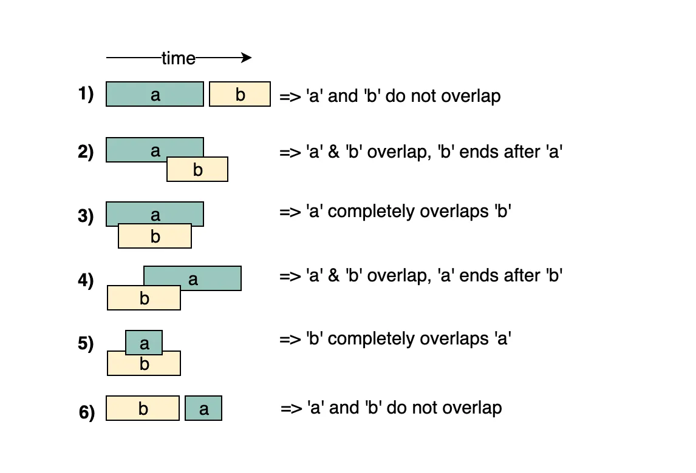

# Arrays:

    
    1. Pre/Post fixes
    2. Two-Pointers
    3. Sliding Window
    4. Merge Intervals
    5. Kadane's Algorithm (Maximum Subarray)
    6. Matrix’s the book-keeper

---

---

## 1. Pre/Post Fixes: [Prefix/Postfix sum,min,max]
- Calculating the prefix/ postfix sum, min or max can help solve a lot of array problems

#### Problems: https://leetcode.com/problem-list/prefix-sum/

 INTERVIEWS 

---

 EASY

1. - [ ] [Find the Middle Index in Array](https://leetcode.com/problems/find-the-middle-index-in-array/description)
2. - [ ] [Find Pivot Index](https://leetcode.com/problems/find-pivot-index/description/)

---

 MEDIUM 

---

 HARD 

- [ ]
- [ ] [Partition array into disjoint intervals](https://leetcode.com/problems/product-of-array-except-self/description/)
- [ ] [Product of an array except self](https://leetcode.com/problems/product-of-array-except-self/description/)
- [ ] [Buy-Sell stocks](https://leetcode.com/problems/best-time-to-buy-and-sell-stock/description/)

---

---

## 2. Two-Pointers
- This pattern involves using two pointers, one at the beginning and one at the end (or some other strategic position) of the array, to traverse and manipulate it efficiently.
- It's often used for tasks like finding pairs with a specific sum, merging sorted arrays, or removing duplicates.
- It usually works well with sorted sequences, where we can start the pointers at the extreme end and update either one to try to reach closer to the result.
- We can use the concept even with unsorted arrays. Container with most water is a very interesting example of that. All we have to do is start the pointers at the extreme ends and try to increase the smaller value so we can find a bigger container!

#### Problems: https://leetcode.com/problem-list/two-pointers/

- [ ] [Two Sum](https://leetcode.com/problems/two-sum/)
- [ ] [Three Sum](https://leetcode.com/problems/3sum/)
- [ ] [Four Sum](https://leetcode.com/problems/4sum/description/)
- [ ] [Three Sum Closest](https://leetcode.com/problems/3sum-closest/)
- [ ] [Shortest Unsorted Continuous Subarray](https://leetcode.com/problems/shortest-unsorted-continuous-subarray/)
- [ ] [Container with most water](https://leetcode.com/problems/container-with-most-water/)

---

---

## 3. Sliding Window
- This technique is useful when you need to process data in a specific window size, like finding the maximum sum of a sub-array of a certain length. 
- It involves maintaining a "window" that slides across the array, allowing you to process elements within that window.
- if we are asked to find a continuous subarray or a substring, the sliding window technique is what we should be looking for.
- The basic structure of the solution is to find the first window and then basically increase the end one by one, and for every increase of the end, check if the start needs to be updated to make the window valid again.

#### Problems: https://leetcode.com/problem-list/sliding-window/

1. [Minimum Size Subarray Sum](https://leetcode.com/problems/minimum-size-subarray-sum/description/)
2. [Longest Repeating Character Replacement](https://leetcode.com/problems/longest-repeating-character-replacement/description/)
3. [Subarray Product Less Than K](https://leetcode.com/problems/subarray-product-less-than-k/description/)
4. [Longest Substring Without Repeating Characters](https://leetcode.com/problems/longest-substring-without-repeating-characters/description/)

---

--- 

## 4. Merge Intervals:
- This pattern deals with merging overlapping intervals, which can be represented using arrays. 
- You might be given a list of intervals and asked to merge any overlapping ones, creating a new list of non-overlapping intervals.

#### Problems:

- [ ] [Merge Intervals](https://leetcode.com/problems/merge-intervals/description/)
- [ ] [Insert Interval](https://leetcode.com/problems/insert-interval/description/)
- [ ] [Interval list intersection](https://leetcode.com/problems/interval-list-intersections/)
- [ ] [Non overlapping intervals](https://leetcode.com/problems/non-overlapping-intervals/description/)

---

---

## 5. Kadane's Algorithm: (Maximum Subarray) 
- This classic problem involves finding the contiguous subarray with the largest sum within a given array. 
- Techniques like Kadane's Algorithm are often used to solve this efficiently.

---

---

## 6. Matrix’s the book-keeper: 
- Sometimes when we aren’t allowed to use extra space, we can use the matrix’s rows/ columns to do the book-keeping.

#### Problems: https://leetcode.com/problem-list/matrix/
- [ ] [Set Matrix Zeroes](https://leetcode.com/problems/set-matrix-zeroes/description/)
- [ ] [Game of Life](https://leetcode.com/problems/game-of-life/description/)

---

---

#### References:
1. https://vaibhavsingh-54243.medium.com/the-array-cheatsheet-4d2b671dbde5
2. https://www.techinterviewhandbook.org/algorithms/array/
3. https://github.com/Chanda-Abdul/Several-Coding-Patterns-for-Solving-Data-Structures-and-Algorithms-Problems-during-Interviews
4. https://www.geeksforgeeks.org/top-50-array-coding-problems-for-interviews/
5. 