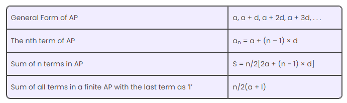

# Arithmetic progression (AP)

In mathematics, there are three different types of progressions. They are:

      Arithmetic Progression (AP)
      Geometric Progression (GP)
      Harmonic Progression (HP)

- An arithmetic progression (AP) is a sequence of numbers where the difference between any two consecutive terms is constant. 
- The constant difference is called the common difference.
- For example, the sequence `2,4,6,8,… `is an arithmetic sequence with the common difference `2`
- We can find the common difference of an AP by finding the difference between any two adjacent terms.
- `
  a, a + d, a + 2d, a + 3d, a + 4d, ………. ,a + (n – 1) d`
- first term = `a`
- common difference = a<sub>n</sub>-a<sub>n-1</sub> = any two terms difference
- n<sup>th</sup> term = a<sub>n</sub> = a + (n − 1) × d
- n = number of terms
### Here are some formulas for arithmetic progressions:
- Common difference: `d=an-an-1`
- n<sup>th</sup> term  : a<sub>n</sub> `= a+(n-1)d`
- Sum of `n` terms: S  = n/2 (first term + last term) =  S<sub>n</sub>`= n/2(2a+(n-1)*d)`




#### Examples:
```text
ap = 1,3,5,7,9,11
first term a = 1
common different d = 3-1 = 2
n=4th term = a+(n-1)xd = 1+(4-1)x2 = 7
```


#### References:
1. https://byjus.com/maths/arithmetic-progression/
2. 
