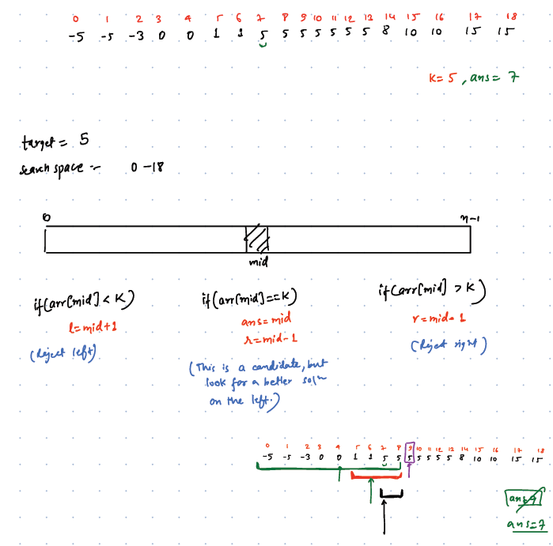
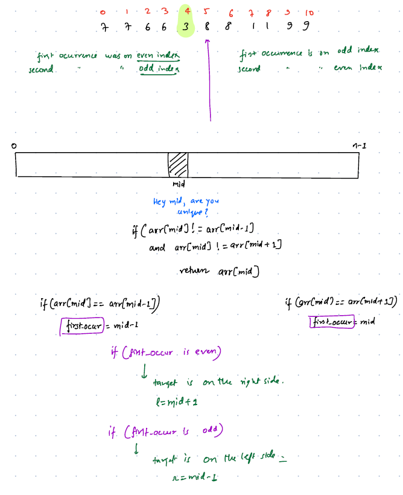
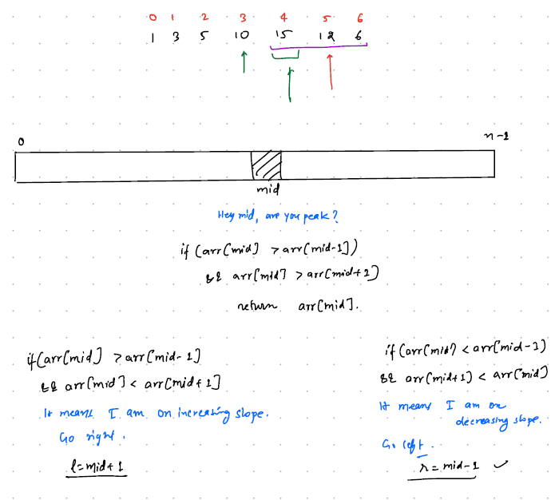
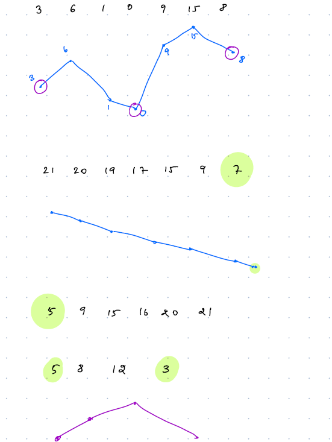
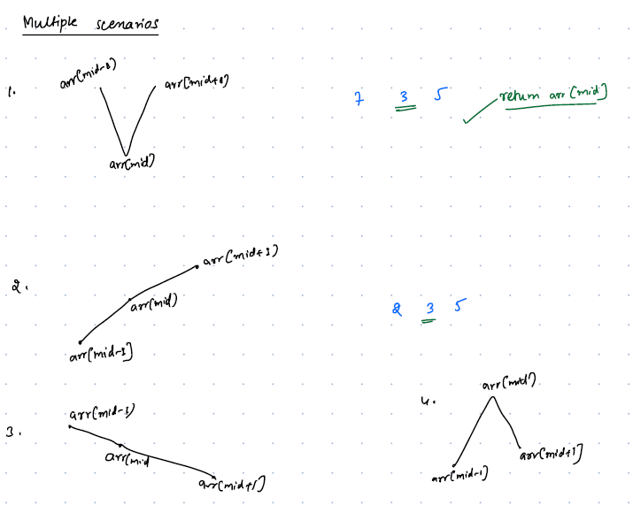
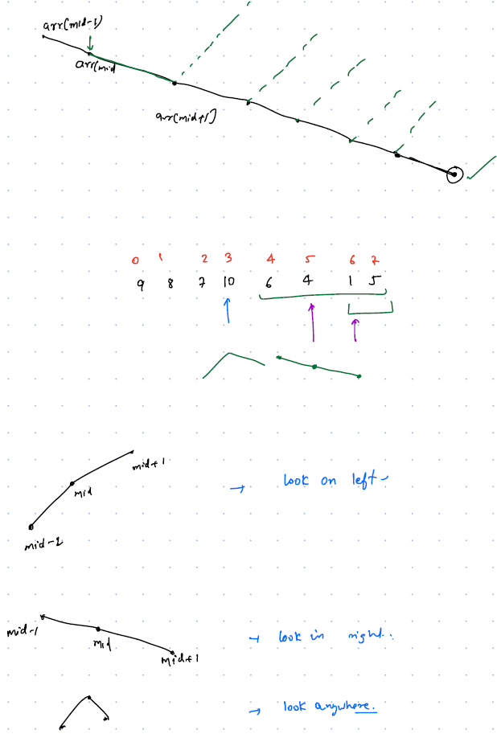

# Searching Notes:
###### SCD 38, 40 ,41

- Looking for something in a particular search space.
- In any search problems we must figure two things 
    
        1. Target: What to Search
        2. Search Space: Where to Search
__Examples:__

| Target   | Search Space          |
|----------|-----------------------|
| Word     | News Paper/Dictionary |
| Phone No | Telephone Directory   |
| Book     | Library/Our Own Shelf |


- There are two types of search mechanisms 

        1. Linear Search
        2. Binary Search

## 1. Linear Search

## 2. Binary Search
- Searching for a word in a dictionary is easier than searching in a newspaper because it is organized/sorted
- Binary Search always works not only on Sorted Search Space, but whenever we are able to reject the possibilities by half.
- In a Binary Search, At every step search space is divided by 2.
- When will I stop my search?
    - If I found the Target in the Search Space
    - Search Space is exhausted.
  
__Problem-Solving Approach:__
-  Identify Search Space and Target
- Find the middle of the Search Space, then check
        
        - If Target <= mid then search for the element in first half/left side of the array
        - Otherwise, Search in second half/right side of the array
__Pseudo Code:__
````text
arr = [1,2,3,4,5,6,7,8,9,10,11,........N]
target = k
//maintain two flags left/start index and right/end index
l = 0, r=N-1
mid = (l+r)/2 or for larger input: l+(r-l)/2 to avoid overflow issues
//iterate until left and right flags crosses or until we find the element
// if we don't find the elements then l and r crosses each other
while(l<=r){
    if(arr[mid] == k){
        return true; //target found 
    }
    if(k < arr[mid]){
        r = mid-1; //look only on left array
    }else {
        l = mid+1; // look only on right array
    }
}
return false;
````

- Binary Search problems are divided into two types
        
        1. Binary Search on Arrays
        2. Binary Search on Answer Space(**Important)

### 2.1 Binary Search on Arrays:
- Target: is an element in the array
- Search Space: Array

__Examples:__
<details>

<summary>Q1. Find K in Sorted Array  </summary>

__problem statement:__

```text
Given a sorted array find the element 'K' if 'K' doesn't exist return -1 
arr = [3, 6, 9, 10, 12, 17, 20, 22, 25, 35] K=6
```
__Approach:__
```text
Brute Force:
------------
    - We can use linear search to find K 
    - it takes TC: O(N)
    
Optimization:
-------------
    - As given array is sorted, we utilize that to improve our solution
    - We use binary search to find the element K
    - It takes TC: O(logN)
```

__code:__
```java
//Search Space: arr
//Target: k
int binarySearch(int[] arr, int k){
  int left = 0, right = arr.length-1;

  while(left <= right){
    int mid = (left+right)/2; //or left+(right-left)/2 to avoid overflow issues
    System.out.println("mid: "+mid +"left: "+left+" right:"+right);
    if(arr[mid] == k){
      System.out.println("Element found at: "+mid);
      return mid; //target found at index=mid
    }
    if(arr[mid] > k){
      right = mid-1;
    }else {
      left = mid+1;
    }

  }
  System.out.println("Element Not found.");
  return -1;
}
//TC: O(logN) SC: O(1)
```
</details>

<details>

<summary>Q2. Find the first occurrence of target K </summary>

__problem statement:__

```text
Given a sorted array of N elements, find the first occurrence of the target element K, if not exist return -1
```
__Approach:__
```text
- Use Binary Search approach as it is except one scenario
- In normal Binary Search we return once we found the target, for this problem if target is found then search on left side of the array to find the first occurrence
arr=[-5, -5, 3, 0, 0, 1, 1, 5, 5, 5, 5, 5, 5, 5, 8, 10, 10, 15, 15 ] K=5 ans=7
```



__code:__
```java
int findFirstOccurrenceOfK(int[] arr, int k){
    int left=0, right=arr.length;
    int ans = -1;
    while (left <=right){
        int mid = left+(right-left)/2;
        if(arr[mid] == k){
            ans = mid;
            right = mid-1;
        }else if(arr[mid] > k){
            right = mid-1;
        }else {
            left = mid+1;
        }
        
    }
    return ans;
}
```
</details>

<details>

<summary> Q3. Find Unique Element </summary>

__problem statement:__

```text
Given an array of Integers, every element occurs twice except one element which occurs only once.find the unique element.
Note: Duplicate elements are adjacent to each other.
arr = [8, 8, 5, 5, 6, 2, 2] ans=6
```
__Approach:__
```text
1. Brute Force: 
---------------
    - For each element iterate over the array and find is there any duplicate element found in the array
    - TC: O(N^2) SC: O(1)
2. Hashing:
    - Create a frequency Map and return element whose frequency is 1
    - TC: O(N) SC: O(N)
3. XOR:
    - XOR of all the array elements
    - A XOR A = 0,  so all the duplicate elements will become zero, only unique elements remains
    - TC: O(N), SC: O(1) 
    
4. Optimization:(Binary Search)
    - If we take an advantage of Note in the problem statement. Note: Duplicate elements are adjacent to each other.
    - Example: [8, 8, 5, 5, 6, 2, 2], if we observe indexes for all the duplicate elements in an array
    - duplicates: first occurrence at even index and second occurrence at odd index 
    - After the unique element it will be changed to first occurrence at odd and second occurrence at even indexes
    - By using this hint we use Binary Search to solve this problem
    - If first element is unique element then compare index=0 with index=1
    - If last element is unique element then compare index=N-1 with index=N-2
    - If mid element is unique element then compare index=mid-1 with index=mid+1 if both are different means mid is unique
    - Otherwise, check based on occurrence indexes
    - If first occurrence is at even index then look on the right side of the array, otherwise, look on the left side. 
        
```


__code:__
```java
static int findUniqueElement(int[] arr){
  int left=0, right=arr.length-1;
  if(arr.length == 1){
    return arr[0];
  }
  //check if the unique element exists at index=0
  if(arr[0] != arr[1]){
    return arr[0];
  }
  //check if the unique element exists at index=N-1
  if(arr[arr.length-1] != arr[arr.length-2]){
    return arr[arr.length-1];
  }

  while(left <=right){
    int mid = left+(right-left)/2;
    //check arr[mid] is the unique element
    if(arr[mid] != arr[mid-1] && arr[mid] != arr[mid+1]){
      return arr[mid];
    }
    //find the first occurence index of the duplicate number
    int firstOccurence;
    //element not found

    if(arr[mid] == arr[mid+1]){
      firstOccurence = mid;
    }else {
      firstOccurence = mid-1;
    }

    if(firstOccurence%2 ==0){
      left = mid+1;
    }else {
      right = mid-1;
    }
  }
  return -1;
}
```
</details>

<details>

<summary>Q4. Find the peak </summary>

__problem statement:__

```text
Given an increasing, decreasing array find the peak element
Example: [1,3,5,2] peak=5
[1,3,5,10,15,12,6] peak=15
```
__Approach:__
```text
Brute Force:
------------
    - Peak element means we need a max value from the array
    - If we use brute force approach it take TC: O(n)
    
Optimization: Binary Search:
-----------------------------
  - calculate the mid and see whether mid is in an increasing slope or decreasing slope
  - if mid is in increasing slope then peak will be on the right of the mid, otherwise, peak will be on the left of the mid 
```




__code:__
```java
static  int findPeakElement(int[] arr){
  int left=0, right=arr.length-1;
  while(left <= right){
    int mid = left+ (right-left)/2;
    if(arr[mid]> arr[mid-1] && arr[mid]> arr[mid+1]){
      return arr[mid];
    }
    //is mid on increasing slope?
    if(arr[mid]> arr[mid-1] && arr[mid]<arr[mid+1]){
      left = mid+1;
    }else {
      right = mid-1;
    }
  }
  return Integer.MIN_VALUE;
}
```
</details>

<details>

<summary>Q5. Fine anyone local Minima </summary>

__problem statement:__

```text
Given an array of N distinct elements, find anyone local minima in the array
Local Minima: A point which is smaller than its neighbours
```
__Examples:__








__Approach:__
```text
Brute Force:
----------
    - Finding the minimum value of the array
    - TC: O(N)
    
Optimization: Binary Search:
----------------------------
    - calculate the mid and check which side dip is possible either left or right and move towards it 
    - If mid greater than it's next element then possible dip is at right side otherwise left
    - Handle edges cases for single element array, first element is local minima and last element may be local minima  
```

__code:__
```java
 static int findLocalMinima(int[] arr){
      if(arr.length == 1)
          return arr[0];

      if(arr[0]<arr[1])
          return arr[0];

      if(arr[arr.length-1]<arr[arr.length-2])
          return arr[arr.length-1];

      int left =0, right=arr.length-1;
      while(left <= right){
          int mid = left + (right-left)/2;
          //check whether mid is the local minima or not
          if(arr[mid] < arr[mid-1] && arr[mid] < arr[mid+1]){
              return arr[mid];
          }
          // mid is greater than next element means local minima will be on the right array
          if(arr[mid] > arr[mid+1]){
              left = mid+1; //dip is towards right
          }else {
              right = mid-1;//dip is towards left
          }

      }
      return -1;
}
```
</details>


