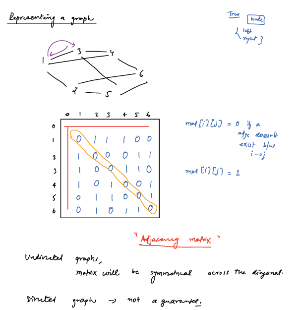

# Graphs:

- Collection of Nodes and Edges
- Types: 
  - Directed and Undirected
  - Cyclic and Acyclic (only for directed)
  - Weighted and Unweighted
  - Connected and Disconnected
  - Degrees of Nodes: (IN/OUT degree)
  
- Every Tree is an acyclic and connected graph
- Max number of edges possible for N nodes:`` N*(N-1)/2``

## Representation of the Graph:

        1. Adjacency Matrix
        2. Adjacency List

### 1. Adjacency Matrix:
- For given N nodes and M edges how to create an Adjacency Matrix?
- First create an NxN Matrix
- Foreach Edge (i,j) mark matrix[i][j] = 1 for directed graph
- Foreach Edge (i,j) mark matrix[i][j] = 1 and matrix[j][i] = 1 for undirected graph
- For all Undirected Graphs Adjacency Matrix is symmetrical

- Checking Edge