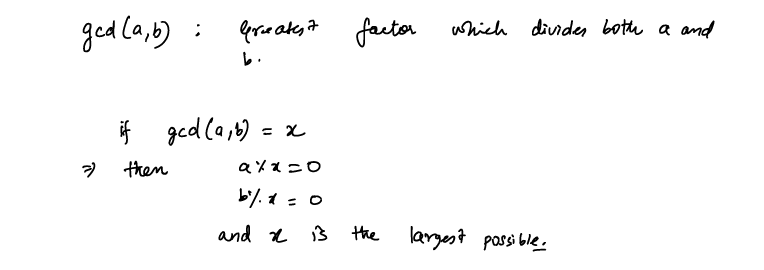
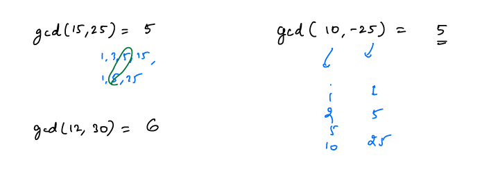
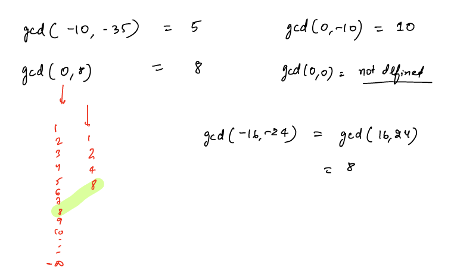
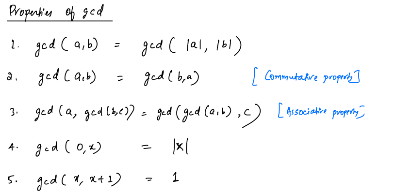
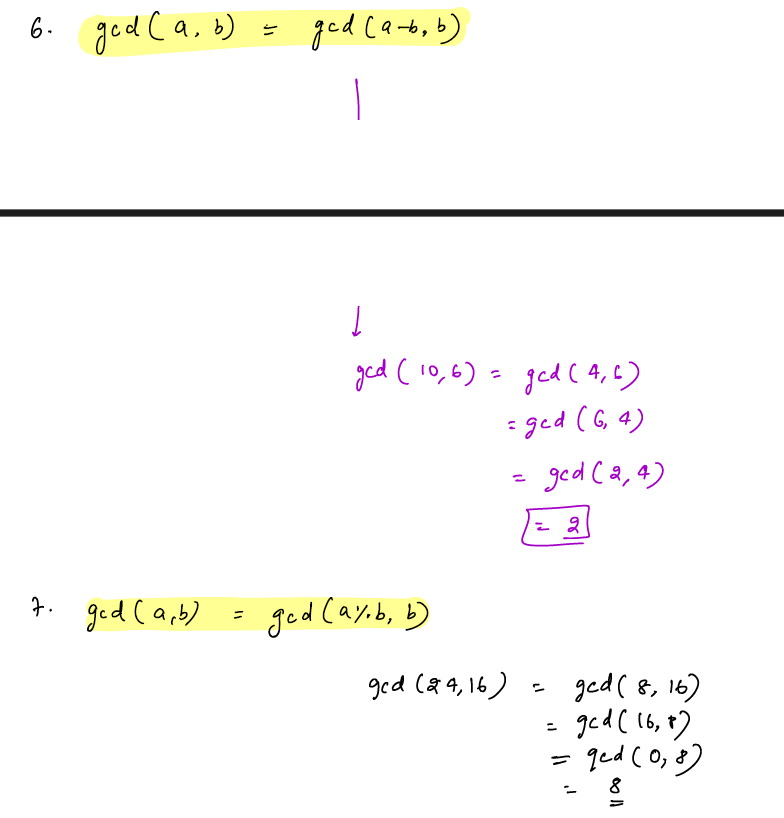
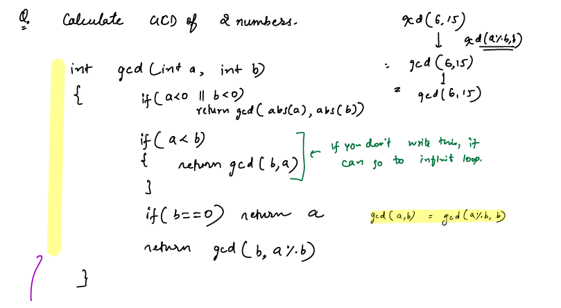

# GCD or HCF
- GCD: Greatest Common Divisor
- HCF: Highest Common Factor

#### Examples:

- As we are looking for the greatest common factors, -ve factors won't be considered.

#### Properties of GCD:

#### Calculate GCD of two numbers:

References:
1. https://www.scaler.com/topics/data-structures/euclidean-algorithm/

