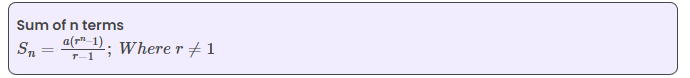
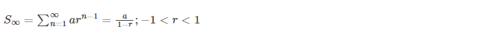

# Geometric Progression (GP)

- GP is a sequence of terms, each succeeding term is generated by multiplying each preceding term with a constant value
- whereas the constant value is called the `common ratio`.
- **For example:** `2, 4, 8, 16, 32, 64, …` is a GP, where the common ratio is `2`.

#### How to find common ration & sum in GP?

- ###### common ratio r = ak+1/ak = ratio of any two terms = 32/16 = 2
- ###### nth term in G.P => an = arn-1 

##### Sum of finite terms:
  
Consider the G.P = a, ar, ar2, ….arn-1

If r=1, then Sn =  a + a + a + ⋯ a= na

When r ≠ 1,

##### Sum of GP for Infinite Terms:

- If the number of terms in a GP is not finite, then the GP is called infinite GP. 
- The formula to find the sum to infinity of the given GP is:

Here,

S∞ = Sum of infinite geometric progression

a = First term of G.P.

r = Common ratio of G.P.

n = Number of terms

#### References:
1. https://byjus.com/maths/geometric-progression-sum-of-gp/
2. 
    
