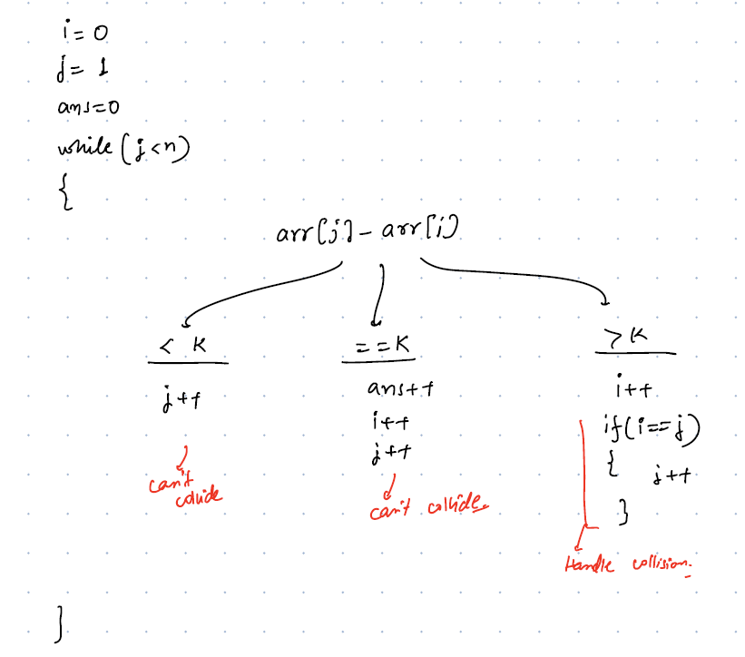
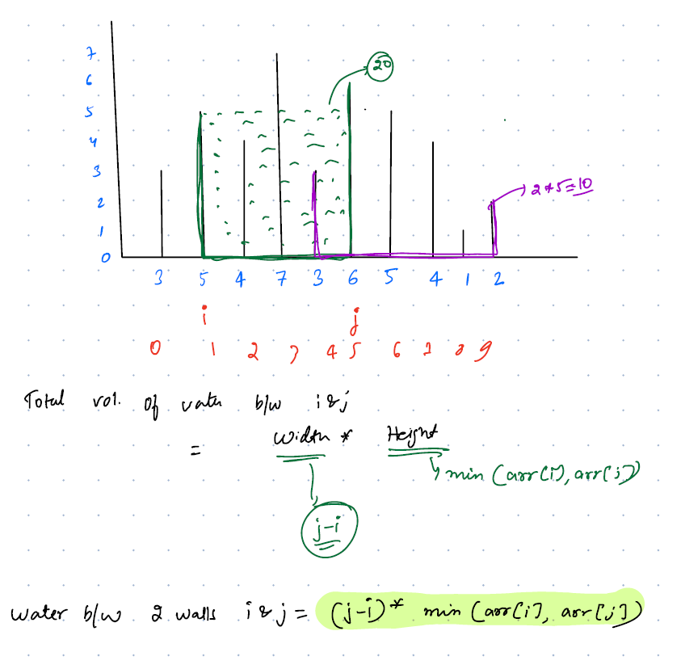

# Two-Pointer Problems Easy

<details>
<summary>Q1. Two Sum II - Input Array Is Sorted</summary>

__problem statement:__
<https://leetcode.com/problems/two-sum-ii-input-array-is-sorted/description/>

__Constraints:__
- Index starts with 1
- Your solution must use only constant extra space.

### Approaches:

__1. Brute Force:__ two loops, for each i iterate j-> i+1 to n-1 if sum matches return [i+1, j+1] TC: O(n^2) SC: O(1)
__2. HashMap:__ 
- For each i find k-arr[i] inside the hashmap if pair is found then return [i+1, map.get(arr[i])+1] otherwise store {arr[i]: index} inside the hashmap
- This approach works for both Sorted and Unsorted array
- TC: O(N) SC: O(N) we need to optimize on SC

__3.Binary Search:__
- As given array is sorted, we can use Binary Search to find the compliment in rest of the array
- For each arr[i] find the k-arr[i] by using Binary Search. it takes logn to search on the array.
- TC: O(nlogn) SC: O(1), TC should be Optimized

__4.Two-pointer: Optimized__
- As array is sorted and we need to find only one pair, so we can use the two-pointer approach
- Where to start the pointers initially? p1=0 and p2=n-1
- How to move the pointers? Based on the sum(p1+p2) will decide which pointer to move.
```java
        if(arr[p1]+arr[p2] == k)
            return new int[]{p1+1, p2+1};
        else if(arr[p1] + arr[p2] > k)
            p2--;
        else
            p1++;
```

__Find Pairs Count with duplicates:__
```java
        var pairCount=0;
        if(arr[p1] + arr[p2] > k)
            p2--;
        else if(arr[p1] + arr[p2] < k)
            p1++;
        else{
            if(arr[p1] == arr[p2]){
             int dupCount = p2-p1;
             pairCount += ((dupCount)*(dupCount-1))/2; //freq C 2
            }else {
                int count1 = 0;
                int e1 = arr[p1];
                while(arr[p1] == e1){
                    count1++;
                    p1++;
                }
                int count2 = 0;
                int e2 = arr[p2];
                while(arr[p2] == e2){
                    count2++;
                    p2--;
                }
                
                pairCount += (count1*count2);
            }   
            
        }
```

__Notes:__
</details>


<details>
<summary>Q2. Two Diff in a Sorted Array: arr[j]-arr[i] = k</summary>

__Problem:__
````text
Given a sorted array, count pairs i,j such that arr[j] - arr[i] == k 
Examples: 
ar = [ -5 -2 1 8 10 12 15] k = 11 Ans: count =1 (12-1 = 11)
ar = [2, 4, 8] k=1 Ans: 0
````
__Approaches:__
1. Brute Force: two loops
2. Hashmap: finding complement
3. Binary Search:
4. Two-pointers: Optimized
    - Where to start two pointers? i=0, j=1
    - How to move two pointers? Based on the diff value
````java
var ans =0;
//9-4 = 5 how to decrease diff by subtracting large values 9-5, 9-6,9-7 so here i should be increased
if(arr[j]-arr[i] > k){
    i++;
    //possibility of collisiion ar = [2, 4, 8] k=1 4-2>1 i++ i=4, j=4 we cannot use same element so if i==j then we need to increase j
   if(i == j)
       j++;
}else if(arr[j] - arr[i] < k) { //9-4 = 5 how to increase diff by subtracting from larger values 10-5, 11-6,12-7 so here j should be increased
    j++;
}else { // here we need to handle duplicates also [3, 3,5,6,6,8,8] k=3 
 if(arr[i] == arr[j]){
    int freq = j-i; //freq c 2
    ans += (freq*(freq-1))/2;
 }else {
    var temp1 = arr[i];
    var count1 = 0;
    while(arr[i] == temp1){
        count1++;
        i++;
    }
    var temp2 = arr[j];
    var count2 = 0;
    while(arr[j] == temp2){
        count2++;
        j++;
    }
    ans += (count1*count2);
  }
 
}
````




</details>


<details>
<summary>Q3.Sub-array sum with K</summary>

__Problem:__
```text
Given an array of +ve numbers, find if there exists a sub-array with sum==k

Example:
ar = [1,2,5,4,3] sum=9  Output: [5,4]
```
__Approach:__

- all the elements are +ve numbers, so prefixSum array will be a sorted array.
- Finding the sub-array sum is nothing but Two-diff equals == k which is exactly the previous question.
- For reference read PrefixSum concept: <https://github.com/prasad-guntakinda/cs-fundamentals/blob/main/2.Arrays/notes/4.PrefixSum_RangeSum%20Technique.md>

__Code:__
````java
var ar1 = {1,2,3,4,5,6};
var k1 = 6;
// subarrays: [1,2,3], [6]

var ar2 = {0,0,0,1,2,3,3,3,4,5,6,6,6,6};
var k2 = 6;
// subarrays: [0,0,0,1,2,3], [0,0,1,2,3], [0,1,2,3] , [1,2,3], [3,3], [3,3], [6], [6], [6], [6],
//count: 10


 //Assumptions:
    //1. All the elements are +ve numbers
    // 2. All the elements are sorted

    public static int subarraysCountWithSumK(int[] ar, int k){
        int ans = 0;
        var pfSum = createPrefixSumArray(ar);
        //As array has all the +ve numbers we will get pfSum as a sorted array
        //Finding two-diff === k in sorted array is nothing but subarray sum
        int i=0, j=1;
        if(pfSum[0] == k){
            ans++;
        }
        while(j<pfSum.length){
            var diff = pfSum[j] - pfSum[i];
            if(diff > k){
                i++;
            }else if(diff < k){
                j++;
            }else {
                if(pfSum[i] == pfSum[j]){
                    var freq = j-i;
                    ans += (freq*(freq-1))/2;
                }else {
                    var iTemp = pfSum[i];
                    var iCount = 0;
                    while(pfSum[i] == iTemp){
                        iCount++;
                        i++;
                    }
                    var jTemp = pfSum[j];
                    var jCount = 0;
                    while(j<pfSum.length && pfSum[j] == jTemp){
                        jCount++;
                        j++;
                    }
                    ans += (iCount*jCount);
                }

            }
        }

        return ans;
    }

    private static int[] createPrefixSumArray(int[] ar) {
        var pfSum = new int[ar.length+1];
        //adding dummy index to mitigate subarrays which starts from index = 0
        //Example [1,2,3,4,5,6] k =6 then sub arrays = [1,2,3], [6]
        pfSum[0] = 0;
        var j=1;
        for(int i=0;i<ar.length;i++){
            pfSum[j] = pfSum[j-1]+ar[i];
            j++;
        }
        return pfSum;
    }
````

</details>

<details>
<summary>Q4.Container with most Water</summary>

__Problem:__ https://leetcode.com/problems/container-with-most-water/description/

```text
Given an array where array elements denotes the height of the wall. 
Find any two walls that can form a container and that can hold the maximum water.
```


__Approach:__

__1. Brute Force:__ 
- For each i wall iterate through i+1 to N-1 and calculate the area
- Find the maximum of it.
- TC: O(N^2) SC: O(1)

__2. Two-Pointers: Optimized:__

- Each element represents a wall
- We need to find the area b/w the walls which should be the maximum area among the pairs
- By using two walls, it will form a rectangular shape and area of it: `height * width`
- __height:__ `min(ar[i], ar[j])`, water will be stored until min of the wall after that it will overflow
- __width:__ `j-i` difference b/w the indexes

- We need to visit each wall at least once to find the max area
- We can use Two-pointers approach solve this problem
- Where to start pointers initially?  we will start the i=0 and j=N-1
- How to move the pointers? Based on the height of the walls



```java
//as we want the maximum volume if p2 wall is smaller then we move p2--
int i=0, j=N-1, ans=0;
while(i<j){
    ans = max(ans, (min(ar[i], ar[j]) * (j-i)));
        if(ar[i] > ar[j]){
            j--;
        }else if(ar[i] < ar[j]){
            i++;
        }else {
            i++;
            j--;
        } 
}

```

__How to Move Pointers?__
- First we calculate the area
- whichever wall is smaller move that pointer towards another pointer
- For Example: wall1 = 2, wall2 = 5 and width: 10 volume: MIN(2,5)*10 = 20, 
- to get the maximum area we have to move the smaller wall to next, wall1 = 3, wall2=5 and width:9 volume: MIN(3,5)*9 = 27
- if both the walls are same then move both the pointers but why? 
- consider wall1 = wall2 = 4 and width 10 then volume: 4*10 = 40, if we keep anyone of the wall it's height is either < 4 or max=4 but width is going to decrease 
- For example: wall1 = 4 wall2 = 10 and width=9 volume: 4*9 = 36, so when both the walls are same we have to move both the pointers otherwise we never get maximum area.

</details>